# 5G mobile communication

## 5G key business indicators (5G flower)

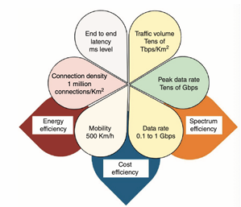
- Petals (KPI)
  - 100x data rate (0.1-1Gbps)
  - 20x peak rate (10-20 Gbps)
  - High traffic volume (10-100Tbps/km^2)
  - Reduced latency(1/5 of 4G)
  - Much higher connection density (1 million/km^2)
  - Increased mobility (500+ km/h)
- Leaves (productivity)
  - Energy efficiency: to manage increased connections and data rates sustainably
  - Cost efficiency : lower the cost per bit of transmitted data
  - Spectrum efficiency : greater data throughput within the existing spectrum

## 5G use cases
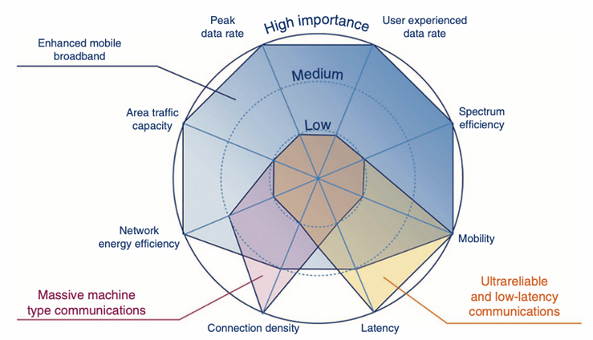
- Enhanced mobile broadband (eMBB) : High data rates/user density/high mobility (ex : hotspots, AR/VR)
- Massive machine-type commucation(mMTC) : low-power, low data-rate connections for IoT devices
- Ultrareliable and low-latency commucation (uRLLC) : requiring security and low latency(autonomous vehicles, smart cities)
## 5G ecosystem
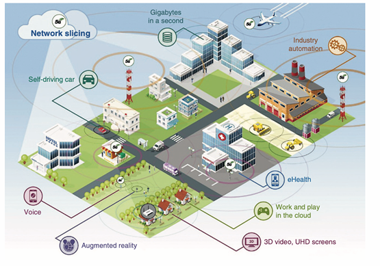
- Device integration : connection of nearly all devices to meet high data rate/low latency
- Network slicing feature : customizes each slice for specfic service with distinct performance metrics
## 5G cell stucture
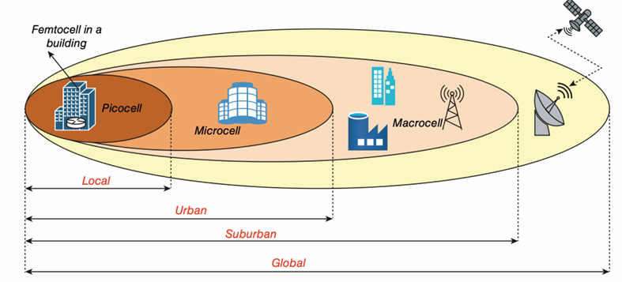
- Femtocell (small cell)
  - is a small device that improve mobile signal at home
  - connect internet to enhance indoor coverage
  - how it work : localized network creation -> user connection -> internet routing -> signal enhancement -> power and infrastructure
- Picocell (small cell)
  - is a business cell tower, larger than femtocell, offering broader coverage and support more users
  - ideal for small areas like mall or stores, bridges the gap between femtocell and microcell
  - deployed scenarios :
    - indoor environments
    - high-density areas
    - Specialized uses
- Microcell
  - is a medium-sized cell tower for urban areas with high demand, offering more coverage and connections
  - supports many users, making it suitable for smart city applications and high-tech transpotation
  - key feature  
    - coverage area : up to 2km
    - purpose : areas with weak macrocell signals
    - power control
    - deployment scenarios : in high density areas
    - network integration : via broadband internet
- Macrocell
  - is the largest cell tower, covering like countryside and suburbs, it often seen as tall towers
  - advantage
    - widespread coverage
    - provides the groundwork for overall network  connectivity
  - disadvantage
    - lower capacity
    - not cover densey populated areas
    - significant costs
- Satellite link
  - for global coverage such as remote, oceanic, or mountainous regions
  - connects with larger cell network, ensuring interation and continuity
  - advantage
    - communication in isolated areas
    - facilitates sea communication
    - enhanced global network coverage
  - disadvantage
    - higher latency
    - performance can be affected by weather
    - higher cost
## Mobile device accessing service
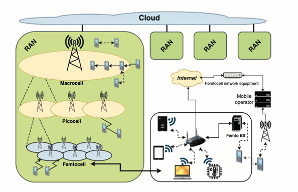
- Mobile device connect to RAN : connects to nearby macrocell, picocell, or femtocell to establish a wireless link with the base station
- Signal transmission to core network : the base station transmits request through the RAN to the cloud, using the internet instead of mobile infrastructure
- Routing via core network : cloud-based network manages multiple RANs and route requests to the core network, femtocell data is first routed via the internet
- Processing & service delivery : processes the request and retrieves the required service, forwarding it to external systems if needed
- Data transmission back : response follow the same route back, for femtocell, data returns via the internet before reaching the device
## 5G hybrid network
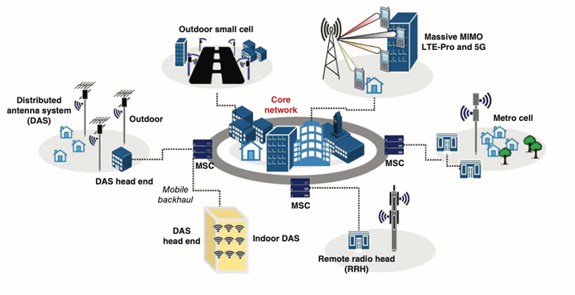
- Distributed antenna system (DAS) : mutiple antennas spread to boost coverage and capacity (like mini cell tower)
  - types
    - outdoor : covers cities
    - indoor : covers buildings
    - DAS head end : central hub managing and distributing signals
- Remote radio head (RRH)* : radio part of cell site placed closer to the antenna for imoroved performance
  - benefits : reduces signals loss and improves network efficiency
  - 備註*：RRH就是基地台的一個component，負責無線訊號的發射與接收，安裝在天線附近。
- Metrocell : small cell focusing on boosting coverage and capacity in high-density urban areas
- Outdoor small cell : similar to metro
  - benefits : fills in coverage gaps left by larger cell towers
- Massive MIMO (multiple input mutiple output) : use many antennas at base station to improve network capacity and efficiency
  - benefits : handles more users and data simutaneously
- Core network : the central hub managing all network traffic and services
  - component : mobile switching center (MSC) for communication accross the network
- Mobile backhaul : connection between cell sites and the core network, carring data trafic
  - importance : crucial for data transfer between cell site and the core
## Topology between 4G & 5G
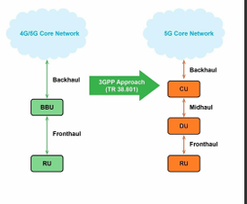
- Network architecture
  - 4G : uses a BBU (basedband unit) that handles both control and data processing, connected directed to the RU (remote unit) via fronthaul
  - 5G : splits BBU into three units
    - central unit (CU) : Manages control and non-real-time functions
    - distributed unit (DU) : handle real-time processing
    - remote unit (RU) : handles RF function 
  - Effect : 5G is more flexible and scalable
- Latency 
  - 4G : higher latency due to centralized processing in the BBU.
  - 5G : lower latency since the DU is placed closer to users, enabling faster real time processing.
- Transport network
  - Effect : 5G's architecture reduces fronthaul reqirements, lowering deployment costs
- Flexibility and scalability
  - 4G : BBU can only handle a fixed number of RUs
  - 5G : CU can manege multiple DUs, enabling massive IoT deployments
- Visualization and network slicing
  - 4G : limited
  - 5G : CU can be virtualized, enabling network slicing and better resource utilization
- 4G Core network
  
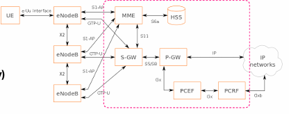
  - centralized components
    - Mobility management entity (MME) : manages mobility and signaling
    - Serving gateway (SGW) : routes data within the network
    - Packet data network gateway (PGW) : connects to external networks
    - Home subscriber server (HSS) : stores subscriber data and authentication
  - Limitation : centralized nature may restrict the network's ability to scale and adapt efficiency
- 5G core network

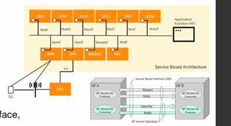
- Service-based architecture (SBA) : enhances the modularity and flexibility of the network's core
- Network function (NF)
  - access and mobility management function (AMF)
  - session plane function (SMF)
  - user plane function (UPF)
  - etc.
- Unified interface (SBI) : NFs communicate over a standardized interface promoting interoperability and flexibility
- Dynamic and scalable configurations : SBA facilitates adaptable and expandable network
- additional information about SBA    
  - easier to adapt the network to different needs
  - separate SW and HW for more flexible control
  - like a virtual switchboard managing traffic instead of physical wires
  - allow managing networks through SW
## 5G access network
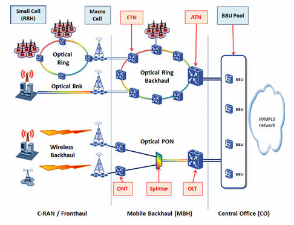
- Radio access (fronthaul)
  - Small cell (RRH) : localized coverage, supporting high data rates and capacity in dense area
  - Macrocell : offers broadband coverage
  - Optical link : connects radio unit to the network using fiber optics for low latency and high bandwidth
- Transport network (backhaul and midhaul)
  - Optical ring backhaul : aggregates data from mutiple cells, ensuring reliable and high-speed transport
  - Ethernet transport network (ETN) : transports data between access point and the core network using Ethernet protocols
  - Access transport network (ATN) : manages the last-mile data transport, optimizing latency and bandwidth 
- Centralized processing (BBU pool)
  - BBU pool : centralized baseband processing for multiple cells, reducing HW costs and enabling efficient resource allocation
  - connects to the core network via an IP/MPLS network to be more scalable and flexible
- Optical passive optical network (PON) for mobile backhaul
  - optical line terminal (OLT) : converts eletrical signals into optical signals for transmission over fiber
  - Splitter : divides the optical signal to serve multiple ONTs
  - optical network terminal (ONT) : converts optical signals back to eletrical signals at the user's location
- Data flow overview
  - fronthaul : RRH and macrocell transmit user data to the BBU pool through optical links
  - midhaul : the optical ring backhaul and Ethernet transport networks aggregate and transport data to the core network
  - backhaul : the IP/MPLS network connects the BBU pool to the 5G core network
- 備註：主要描述的是5G接入網（5G Access Network），但仍然包含一些4G網路的回傳技術。這可能是因為5G初期部署時，許多營運商會與現有的4G基礎設施共存（NSA, 非獨立組網），而非完全獨立的5G核心網（SA, 獨立組網）
## 5G core service-based architecture with MEC system and IMS core
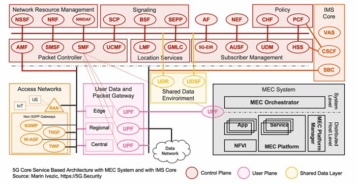
- Access network
  - radio access network (RAN) : connects UEs to the core network
  - non-3GPP gateways : like Wi-Fi, private network
    - Non-3GPP Interworking Function (N3IWF)
    - Trusted Non-3GPP Gateway Function (TNGF) & Trusted Wireless Interworking Function (TWIF)
    - Wireline Access Gateway Function (W-AGF)
- User data and packet gateway 
  - user plane function (UPF) : manage user tarffic flow in three layers
    - edge UPF : located near users for low latency application
    - regional UPF : intermediate processing and routing
    - central UPF : connects to external data networks
- 5G core network : 
  - control plane function
    - access & mobility function (AMF) : manages device regstration, authentication, and mobility
    - Session management function (SMF) : handles session control and IP address allocation
    - Network slice selection function (NSSF) : allocates resources for different applications
    -  Policy control function (PCF) : enforces quality of service (QoS) and network policies
    -  Unified data management (UDM) : manages subcriber profiles 
  -  shared data layer 
     -  Unified data repository (UDR) : stores user and network data
     -  Unstructured data storage function (UDSF) : handles temporary or less-structured data
  - subscriber & security management
    - authentication server function (AUSF) : ensures user authentication
    - home subscriber server (HSS) : stores user credentials and subscription data
  - signaling & policy functions 
    - network repository function (NRF) : service discovery and function registration 
    - network data analytics function (NWDAF) : AI-based network analytics for optimization
  - MEC system
    - Muti-access edge computing (MEC) : low-latency application by processing data closer to the user
    - Key components
      - MEC orchestrator : maneges edge computing resources
      - MEC platform : provides service like caching, real-time processing, and AI-based applications
      - network function virtualization infrastructure (NFVI) : virtualized computing resource for MEC
  - IMS core : enables voice, video, and messaging services over 5G
    - call session control function (CSCF) : manages VoIP calls
    - session border controller (SBC) : secures VoIP traffic
    - value-added services (VAS) : additional features like voicemail
    - 備註：VoIP是一種基於IP的語音傳輸
  - Network function virtualization (NFV) 
    - network function like firewalls into SW
    - makes more flexible and efficient to manege
    - imagine running multiple virtual firewalls
## 5G layer structure
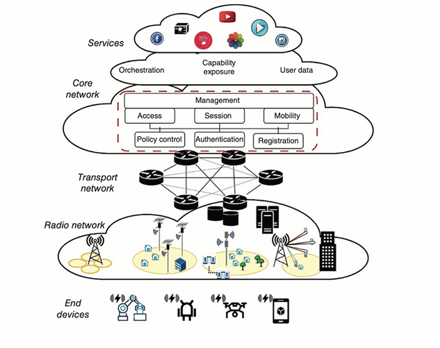
- End devices : connect to access 
network services like smartphones, IoT devices
- Radio network : base stations communicate wirelessly with devices, handling data transmission over radio waves.
- Transport network : routers and switches form the backbone, linking the radio network to the core for seamless data flow.
- Core network
  - access & authentication : manages device connectivity and security
  - session & mobikity : ensures stable data sessions and smooth handovers between cells.
  - policy control : reulates service quality and data usage
  - registration : tracks devices for organized connectivity
  - service : hosts apllication like streaming, social media, and cloud storage for user interaction
    - ochestration : automates and maneges core network component for efficiency
    - capability exposure : can customize services using network functionalities
    - user data 
  - operational flow :　Devices initially connect wirelessly to 
base stations -> Carries data from radio to core network -> Oversees security, policies, and data routing -> Delivers requested content completing the process
## Spetrum allocation and usage in 5G ecosystem
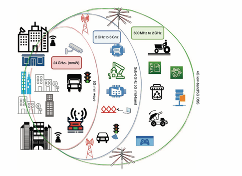
- 600MHz - 2GHz
  - cover large areas, penetrates building
  - ideal for IoT in farming and industry
- 2GHz - 6GHz
  - balance coverage and data capacity
  - enhances mobile performance in urban and suburban areas
- 24GHz+ (mmWave)
  - fast data transfer 
  - best short-range outdoor use in busy urban areas
## Milimeter wave
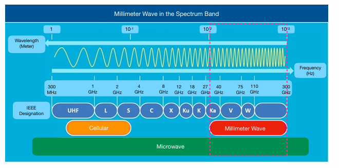
- characteristics
  - frequency : 30-300GHz
  - 備註：不過在5G網路中，所使用的頻段在24GHz-100GHz，與廣義毫米波定義不同
  - high bandwidth, good for speeds
  - wek signal, susceptible to attenuation
  - require high transmit power and massive MIMO
- benefits
  - less congested frequency band
  - high data capacity due to high frequencies
  - support massive MIMO antenna arrays
## mmWave spetrum
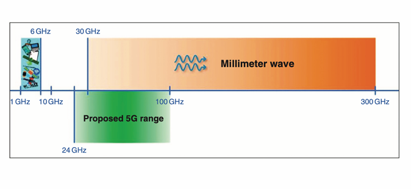
- sub-6 GHz range
  - used for cellular networks
  - balance coverage and capacity
  - common in LTE and early 5G
- proposed 5G range
  - suggested frequency range for 5G reaches into the lower mmWave spetrum
  - quicker data speeds and more connections at once
- millimeter wave
  - very fast data speeds and quick response but cover shorter areas
  - work well in busy city spot or to boost capacity in crowed places
## fronthaul vs. backhaul
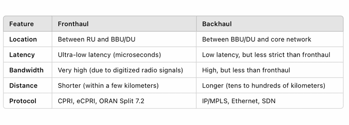
## mmWave application
- 5G mobile applications
- small cell fronthaul and backhaul
- mobile backhaul
- fixed broadband
- video surveillance backhaul
- TV signal relay
- broadband to government
- redundant network
- temporary infrastructure
## Overview of 5G subcomponent
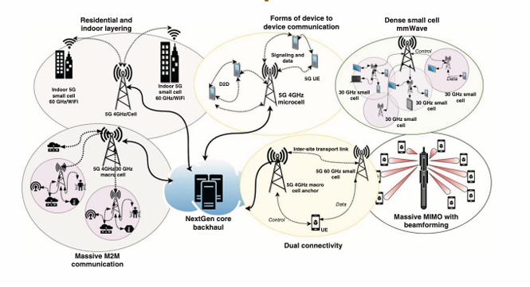
- Residential and indoor layering
  - 60 GHz frequency : optimized for indoor connectivity with short distances and minimal obstructions
  - 4 GHz frequency : link access point to the base station for extended coverage
  - operational flow : devices connect to nearby small cell via 60 GHz/Wi-Fi for fast indoor internet -> switch to 4 GHz when 60 GHz is out of range
-  device to device communication (D2D)
   -  direct communication : through D2D links, coordinated by a microcell base station
   -  4 GHz links : connectiing to the core network
   -  operational flow : 
      -  D2D :  allow for direct commmunication, reducing core network load
      -  5G microcells : provide connectivity to network services, ensuring infrastructure availability
- Dense small cells
  - 30 GHz cell networks : hierarchically from femtocell to global macro cell
  - management : coordinated by standard base station
  - dense devices : high connectivity density
    - indoor frequency : 60GHz for indoor area
    - outdoor microcell for IoT : 4 to 30 GHz
- Dual connectivity :  
  - mobile device connectivity : receives control commands from the macro cell and tarnsmit data via the small cell base station
  - coordination link : established between main and small cell sites for seamless operation
- Massive MIMO base station
  - macro cell centers : with multiple antennas for high-density connection
  - 6G evolution : anticipated to adopt holographic MIMO, improving spatial data management
- 備註：holographic MIMO 全息多輸入多輸出原理是利用超表面或其他電磁調控裝置生成全息圖，進而精確操縱電磁波，簡而言之就是3D的訊號，主要用兩個研究方向
  - 全息波束成型：通過調控電磁波的相位和振幅，將信號能量集中在目標方向或區域，增強接收信號的功率。
  - 全息通信：利用電磁場的空間模式來傳輸信息，實現多通道通信，從而顯著提高通信容量和效率
## Network slicing
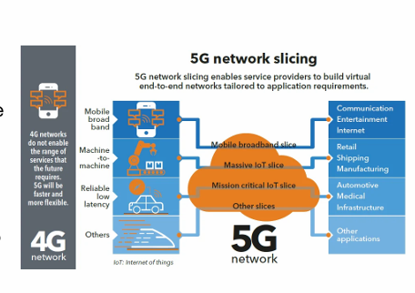
- customization : each slice is tailored to different applications specific performance, latency, and bandwidth needs
- efficiency : multiple virtual network operate on the same physical infrastructure, reducing costs and increasing scalability
- isolation : logically isolated, ensuring that performance issues in one slice do not affect others
- flexibility : can rapidly create and modify slices to meet evolving demands
- background demands 
  - diverse service needs
  - combining various architecture and standards
  - flexibility, scalability, and adaptability
- application
  - creates slices for different services
  - uses SDN and NFV for dynamic resource allocation
  - optimized network topology and resource allocation for each service
- software defined network (SDN)  : 是一種網路架構，通常直接負責管理數據流量，且控制設備和硬體設備被分離，使得網路流量的管理由軟體集中控制器負責，而硬體設備執行指令。常被應用在：提高網路管理效率、支援虛擬化以及適應不同的企業需求，尤其在雲端計算和大數據
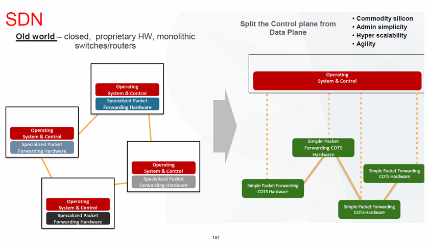
- network function virtualization (NFV) : 是一種技術架構，用於將網路功能從硬體設備中分離並虛擬化到軟體環境中，可使網路功能如：防火牆、路由器、負載均衡器，在普通得伺服器上運行，不需要特定的硬體設備
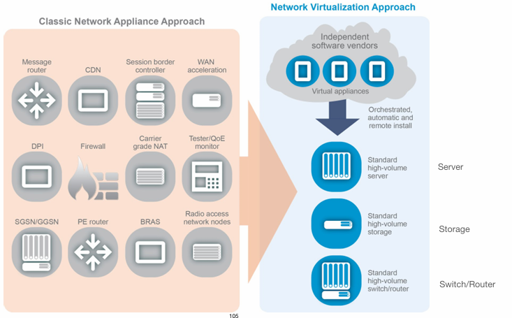
- SDN + NFV : 
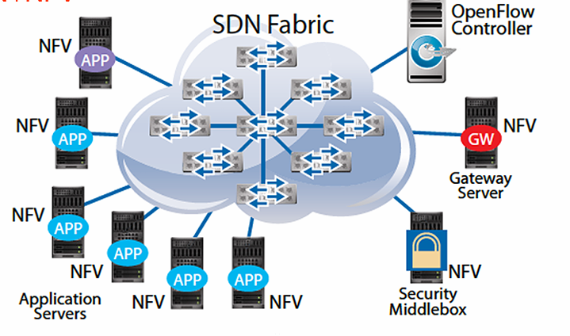
## Mobile edge computing (MEC)
- local data processing : reduces latency by processing data near users, minimizing transmissions to central data centers
- application hosting : low latency application like video streaming, AR and autonomous driving
- service orchestration 
  - MEC orchestrator manages MEC resources
  - MEC platform manager handles platform operations
- distributed infrastruture : operates at the edge with NFV infastructure enabling localized data offloading via UPF
- 5G core integration : reduce network congestion, enhancing IoT, AR and autonomous services
- 複習：UPF是user plane function，是5G核心網路的重要組件，負責處理和轉發使用者的封包，並提供數據的本地端卸載，代表數據可以再靠近使用者的網路邊緣進行處理，不用通過核心網路傳輸
## MEC layered network slices
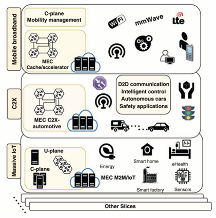
- mobile broadband 
  - basic layer offering high-speed internet to mobile devices
  - C-plane mobility management : manages connection and user movement to keep devices consistently connected
  - MEC cache/accelerator : store content near users and speed up processing to reduce lag and manage data  treffic effectively
  - connection types
    - WiFi : devices using local wireless network
    - LTE : reliable connections over larger areas with 4G network
    - mmWave : provides high-speed connections using high-frequency waves
  - MEC utilization : data is processed near the users to accelaerate delivery timesm essential for applications requiring rapid response
- cellular vehicle to everything (C-V2X)
  - C2X connectivity : cellular network's integration with vehicles and infrastructure
  - MEC C2X-automotive system : designed for rapid in-car data processing to support communication services
  - D2D communication : enable direct communication between vehicles or with road infrastructure, omitting the core network.
  - intelligent control : network-driven management of smart vehicle systems for enhanced traffic control
  - autonomous cars network : dedicated network segment specifically designed for the needs of selfdriving vehicles
  - safety applications : essential functions like crash prevention for vehicle safety
  - MEC utilization :  data from vehicles is processed swiftly at a nearby MEC, with the capability to connect to the larger mobile network for complex processing needs.
  - 備註：這段知識要好好的學習跟擴充，未來主要會往這裡發展
- massive IoT 
  - massive IoT network : supports a vast of IoT devices
  - user plane : dedicated to data transfer between devices
  - control plane : manage control messages within the network.
  - MEC in IoT : enhance data processing speeds for IoT and machine communications
  - IoT applications 
    - energy management : optimizing energy use in various settings
    - smart homes : enhancing home automation and intelligence
    - healthcare monitoring : remote and automated patient monitoring systems.
    - manufacturing automation : streamlining manufacturing processes through automation.
    - data collection : using sensors to gather and analyze data from the environment.
## Massive MIMO and beamforming
- mmWave characteristics
  - effeciveness reduces with distance
  - necessitate smaller coverage areas compared to 4G
  - signal strength improved by using antenna arrays
- Massive MIMO benefits
  - employ numerous antennas at both ends to enhance capacity and data rate
  - enhanced 5G's resistance to interference and jamming
  - boost efficiency and performance, paticularly in areas with high user density
  - essential for achieving high data rates and consistent performance in 5G, crucial for IoT
- full dimsnsion MIMO
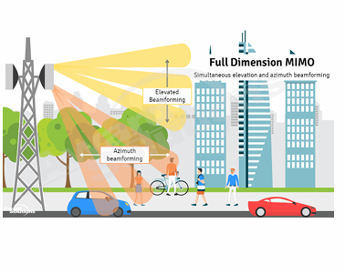
- base station : generates multiple beans using advanced antennas
- elevated beamforming : vertical beams for high-altitude users
- azimuth beamforming : horizontal beams for grounded-level users
- urban environment : maintains coverage despite obstacles
- advantage 
  - high data rates
  - better coverage
  - lower interference
  - efficient spectrum use
- application
  - 5G/B5G/6G
  - smart cities
  - IoT
  - autonomous vechicles
## 4G network vs. 5G network with massive MIMO and beamforming
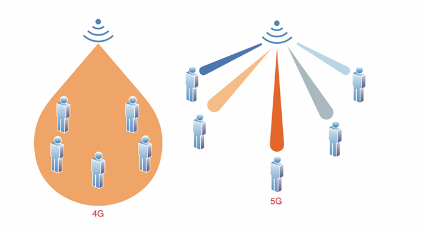
- 4G networks
  - cell tower emit signals uniformly
  - signals cover all directions
  - users within coverage area receive consistent signal strength
  - proximity to the tower dosen't affect signal strength
- 5G network with massive MIMO and beamforming
  - massive MIMO
    - handle multiple users concurrently
    - utilize numerous antennas for targeted beam transmission
  - beamforming
    - signal focusing on specific devices
    - improve signal quality
## MIMO vs. massive MIMO
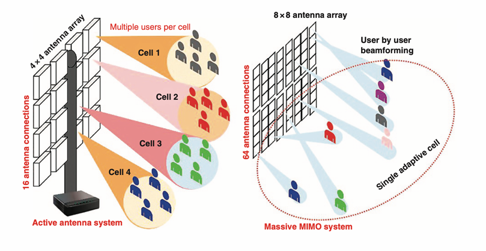
- MIMO system
  - 4x4 MIMO antennas array : comprise 16 independently functioning antennas
  - user support : capable of serving multiple users in different area simultaneously
  - multiple data streams : increase network speed and capacity by sending sereral data streams at once
  - spatial multiplexing : send multiple streams through separate spatial paths, enhancing data throughput and network reliability
  - user capacity limitation : user capacity limited by available antennas
- massive MIMO
  - 8 x 8 antenna array : enable 64 connections, exceed standard MIMO systems's user capacity
  - beamforming technology : direct signal focusing on users, enhancing signal strength and efficiency
  - high device support : support a large number of devices simultaneously
  - adaptive signal beams : adjustable signal beams, optimize coverage and speed
  - network improvements : more efficient spectrum use, faster data  transfer rates
## Carrier aggregation (CA) and dual connectivity (DC)
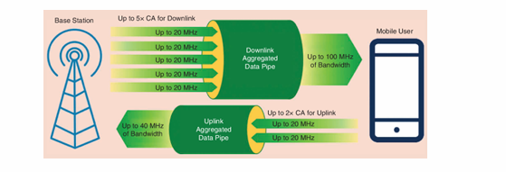
- carrier aggregation : merges multiple radio frequency carriers into single logical channel to increase data capacity and throughput, optimizing spectrum usage, enhancing both uplink and downlink
  - key component 
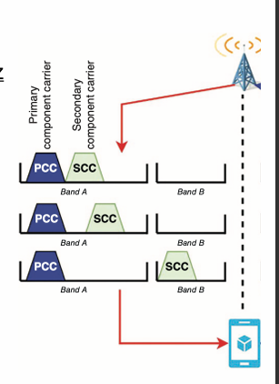
    - component carriers (CCs) : frequency bands that can be up to 20 MHz each, aggregated to form a larger bandwidth
    - primary component carrier (PCC) : main carrier responsible for control signaling and primary data transfer
    - secondary component carriers (SCC) : boost data throughput, only transmit user data, not control signaling
  - types of carrier aggregation
    - intra-band contiguous CA : mutiple CCs are within the same frequency band and are directly adjacent to each other namely no guard bands
    - intra-band non-contiguous CA : mutiple CCs are within the same frequency band but are separated by frequency gaps, requiring more advanced HW 
    - inter-band CA : CCs are located in different frequency bands, enabling greater bandwidth and requiring advanced HW 
  - 備註：LTE 跟 NR 在 CA 的差別主要體現在
    - 頻寬：4G LTE Carrier Aggregation 最多支持 5 個 Component Carriers (CC)，每個頻寬最大為 20 MHz，總頻寬可達 100 MHz。5G NR Carrier Aggregation 則支持最多 16 個 CC，頻寬可達 1 GHz，性能大幅提升
    - 4G LTE Carrier Aggregation 主要在低頻段（FR1）運作。5G NR Carrier Aggregation 則涵蓋低頻段（FR1）和高頻段（FR2），包括毫米波頻段。
    - 且 NR 提供更高的數據速率和更低的延遲
- dual connectivity : simultaneiously connects a device to two base stations on different carriers, imporving throughpurm, reliability, and seamless handovers
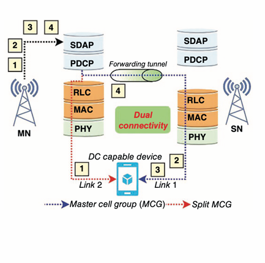
  - component
    - master node (MN) : primary base station responsible for control signaling and part of the user data
    - secondary node (SN) : provides additional data capacity, focusing on user data rather than control signaling
    - user equipment (UE) : mobile devices connect to both MN and SN
  - type of dual connectivity
    - intra-RAT dual connectivity : both nodes belong to the same radio access technology (RAT), such as LTE-LTE or NR-NR
    - inter RAT dual connectivity : nodes belong to different radio access technology (RAT) such as LTE-NR
## CA vs. DC
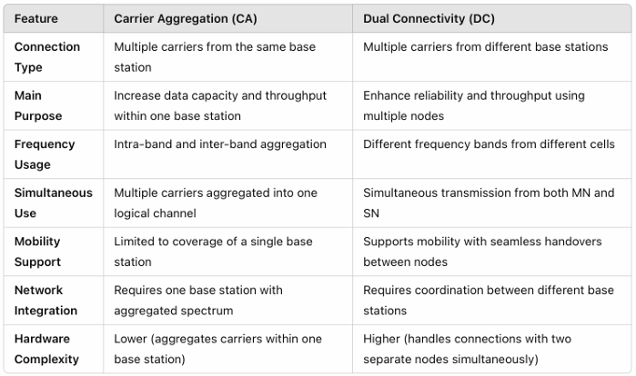

