# 5G mobile communication

## 5G key business indicators (5G flower)

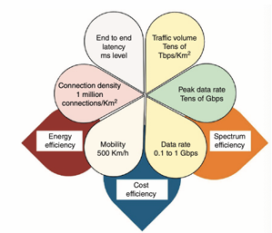
- Petals (KPI)
  - 100x data rate (0.1-1Gbps)
  - 20x peak rate (10-20 Gbps)
  - High traffic volume (10-100Tbps/km^2)
  - Reduced latency(1/5 of 4G)
  - Much higher connection density (1 million/km^2)
  - Increased mobility (500+ km/h)
- Leaves (productivity)
  - Energy efficiency: to manage increased connections and data rates sustainably
  - Cost efficiency : lower the cost per bit of transmitted data
  - Spectrum efficiency : greater data throughput within the existing spectrum

## 5G use cases
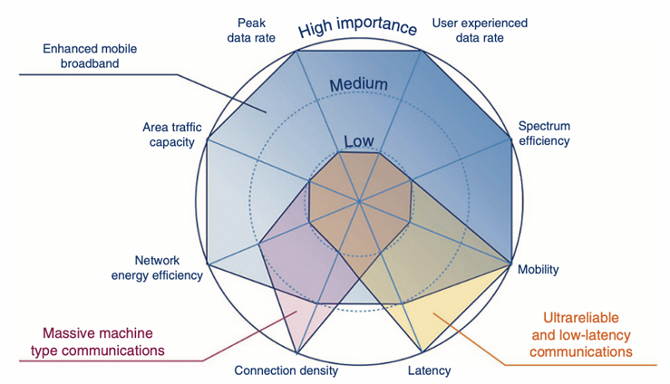
- Enhanced mobile broadband (eMBB) : High data rates/user density/high mobility (ex : hotspots, AR/VR)
- Massive machine-type commucation(mMTC) : low-power, low data-rate connections for IoT devices
- Ultrareliable and low-latency commucation (uRLLC) : requiring security and low latency(autonomous vehicles, smart cities)
## 5G ecosystem
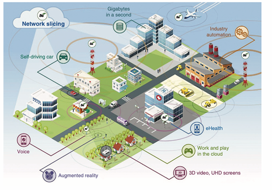
- Device integration : connection of nearly all devices to meet high data rate/low latency
- Network slicing feature : customizes each slice for specfic service with distinct performance metrics
## 5G cell stucture
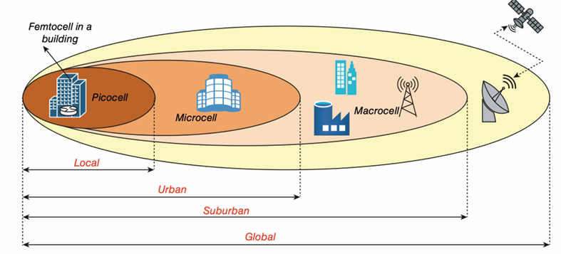
- Femtocell (small cell)
  - is a small device that improve mobile signal at home
  - connect internet to enhance indoor coverage
  - how it work : localized network creation -> user connection -> internet routing -> signal enhancement -> power and infrastructure
- Picocell (small cell)
  - is a business cell tower, larger than femtocell, offering broader coverage and support more users
  - ideal for small areas like mall or stores, bridges the gap between femtocell and microcell
  - deployed scenarios :
    - indoor environments
    - high-density areas
    - Specialized uses
- Microcell
  - is a medium-sized cell tower for urban areas with high demand, offering more coverage and connections
  - supports many users, making it suitable for smart city applications and high-tech transpotation
  - key feature  
    - coverage area : up to 2km
    - purpose : areas with weak macrocell signals
    - power control
    - deployment scenarios : in high density areas
    - network integration : via broadband internet
- Macrocell
  - is the largest cell tower, covering like countryside and suburbs, it often seen as tall towers
  - advantage
    - widespread coverage
    - provides the groundwork for overall network  connectivity
  - disadvantage
    - lower capacity
    - not cover densey populated areas
    - significant costs
- Satellite link
  - for global coverage such as remote, oceanic, or mountainous regions
  - connects with larger cell network, ensuring interation and continuity
  - advantage
    - communication in isolated areas
    - facilitates sea communication
    - enhanced global network coverage
  - disadvantage
    - higher latency
    - performance can be affected by weather
    - higher cost
## Mobile device accessing service
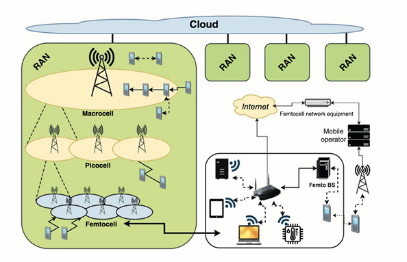
- Mobile device connect to RAN : connects to nearby macrocell, picocell, or femtocell to establish a wireless link with the base station
- Signal transmission to core network : the base station transmits request through the RAN to the cloud, using the internet instead of mobile infrastructure
- Routing via core network : cloud-based network manages multiple RANs and route requests to the core network, femtocell data is first routed via the internet
- Processing & service delivery : processes the request and retrieves the required service, forwarding it to external systems if needed
- Data transmission back : response follow the same route back, for femtocell, data returns via the internet before reaching the device
## 5G hybrid network
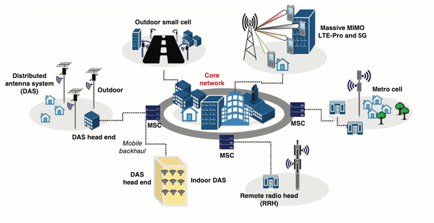
- Distributed antenna system (DAS) : mutiple antennas spread to boost coverage and capacity (like mini cell tower)
  - types
    - outdoor : covers cities
    - indoor : covers buildings
    - DAS head end : central hub managing and distributing signals
- Remote radio head (RRH)* : radio part of cell site placed closer to the antenna for imoroved performance
  - benefits : reduces signals loss and improves network efficiency
  - 備註*：RRH就是基地台的一個component，負責無線訊號的發射與接收，安裝在天線附近。
- Metrocell : small cell focusing on boosting coverage and capacity in high-density urban areas
- Outdoor small cell : similar to metro
  - benefits : fills in coverage gaps left by larger cell towers
- Massive MIMO (multiple input mutiple output) : use many antennas at base station to improve network capacity and efficiency
  - benefits : handles more users and data simutaneously
- Core network : the central hub managing all network traffic and services
  - component : mobile switching center (MSC) for communication accross the network
- Mobile backhaul : connection between cell sites and the core network, carring data trafic
  - importance : crucial for data transfer between cell site and the core
## Topology between 4G & 5G
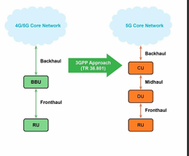
- Network architecture
  - 4G : uses a BBU (basedband unit) that handles both control and data processing, connected directed to the RU (remote unit) via fronthaul
  - 5G : splits BBU into three units
    - central unit (CU) : Manages control and non-real-time functions
    - distributed unit (DU) : handle real-time processing
    - remote unit (RU) : handles RF function 
  - Effect : 5G is more flexible and scalable
- Latency 
  - 4G : higher latency due to centralized processing in the BBU.
  - 5G : lower latency since the DU is placed closer to users, enabling faster real time processing.
- Transport network
  - Effect : 5G's architecture reduces fronthaul reqirements, lowering deployment costs
- Flexibility and scalability
  - 4G : BBU can only handle a fixed number of RUs
  - 5G : CU can manege multiple DUs, enabling massive IoT deployments
- Visualization and network slicing
  - 4G : limited
  - 5G : CU can be virtualized, enabling network slicing and better resource utilization
- 4G Core network
  
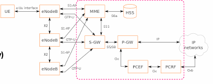
  - centralized components
    - Mobility management entity (MME) : manages mobility and signaling
    - Serving gateway (SGW) : routes data within the network
    - Packet data network gateway (PGW) : connects to external networks
    - Home subscriber server (HSS) : stores subscriber data and authentication
  - Limitation : centralized nature may restrict the network's ability to scale and adapt efficiency
- 5G core network

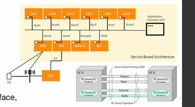
- Service-based architecture (SBA) : enhances the modularity and flexibility of the network's core
- Network function (NF)
  - access and mobility management function (AMF)
  - session plane function (SMF)
  - user plane function (UPF)
  - etc.
- Unified interface (SBI) : NFs communicate over a standardized interface promoting interoperability and flexibility
- Dynamic and scalable configurations : SBA facilitates adaptable and expandable network
- additional information about SBA    
  - easier to adapt the network to different needs
  - separate SW and HW for more flexible control
  - like a virtual switchboard managing traffic instead of physical wires
  - allow managing networks through SW
## 5G access network
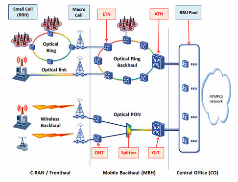
- Radio access (fronthaul)
  - Small cell (RRH) : localized coverage, supporting high data rates and capacity in dense area
  - Macrocell : offers broadband coverage
  - Optical link : connects radio unit to the network using fiber optics for low latency and high bandwidth
- Transport network (backhaul and midhaul)
  - Optical ring backhaul : aggregates data from mutiple cells, ensuring reliable and high-speed transport
  - Ethernet transport network (ETN) : transports data between access point and the core network using Ethernet protocols
  - Access transport network (ATN) : manages the last-mile data transport, optimizing latency and bandwidth 
- Centralized processing (BBU pool)
  - BBU pool : centralized baseband processing for multiple cells, reducing HW costs and enabling efficient resource allocation
  - connects to the core network via an IP/MPLS network to be more scalable and flexible
- Optical passive optical network (PON) for mobile backhaul
  - optical line terminal (OLT) : converts eletrical signals into optical signals for transmission over fiber
  - Splitter : divides the optical signal to serve multiple ONTs
  - optical network terminal (ONT) : converts optical signals back to eletrical signals at the user's location
- Data flow overview
  - fronthaul : RRH and macrocell transmit user data to the BBU pool through optical links
  - midhaul : the optical ring backhaul and Ethernet transport networks aggregate and transport data to the core network
  - backhaul : the IP/MPLS network connects the BBU pool to the 5G core network
- 備註：主要描述的是5G接入網（5G Access Network），但仍然包含一些4G網路的回傳技術。這可能是因為5G初期部署時，許多營運商會與現有的4G基礎設施共存（NSA, 非獨立組網），而非完全獨立的5G核心網（SA, 獨立組網）
## 5G core service-based architecture with MEC system and IMS core
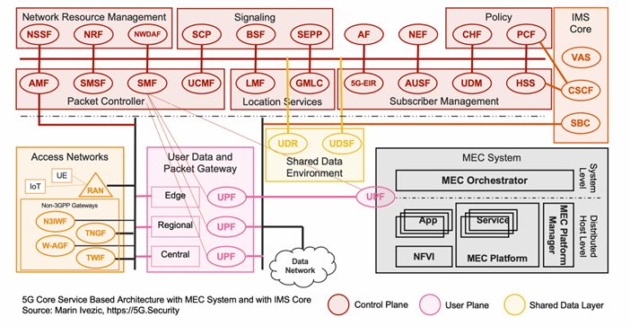
- Access network
  - radio access network (RAN) : connects UEs to the core network
  - non-3GPP gateways : like Wi-Fi, private network
    - Non-3GPP Interworking Function (N3IWF)
    - Trusted Non-3GPP Gateway Function (TNGF) & Trusted Wireless Interworking Function (TWIF)
    - Wireline Access Gateway Function (W-AGF)
- User data and packet gateway 
  - user plane function (UPF) : manage user tarffic flow in three layers
    - edge UPF : located near users for low latency application
    - regional UPF : intermediate processing and routing
    - central UPF : connects to external data networks
- 5G core network : 
  - control plane function
    - access & mobility function (AMF) : manages device regstration, authentication, and mobility
    - Session management function (SMF) : handles session control and IP address allocation
    - Network slice selection function (NSSF) : allocates resources for different applications
    -  Policy control function (PCF) : enforces quality of service (QoS) and network policies
    -  Unified data management (UDM) : manages subcriber profiles 
  -  shared data layer 
     -  Unified data repository (UDR) : stores user and network data
     -  Unstructured data storage function (UDSF) : handles temporary or less-structured data
  - subscriber & security management
    - authentication server function (AUSF) : ensures user authentication
    - home subscriber server (HSS) : stores user credentials and subscription data
  - signaling & policy functions 
    - network repository function (NRF) : service discovery and function registration 
    - network data analytics function (NWDAF) : AI-based network analytics for optimization
  - MEC system
    - 

