# 6G mobile communication

## Evolution to 6G
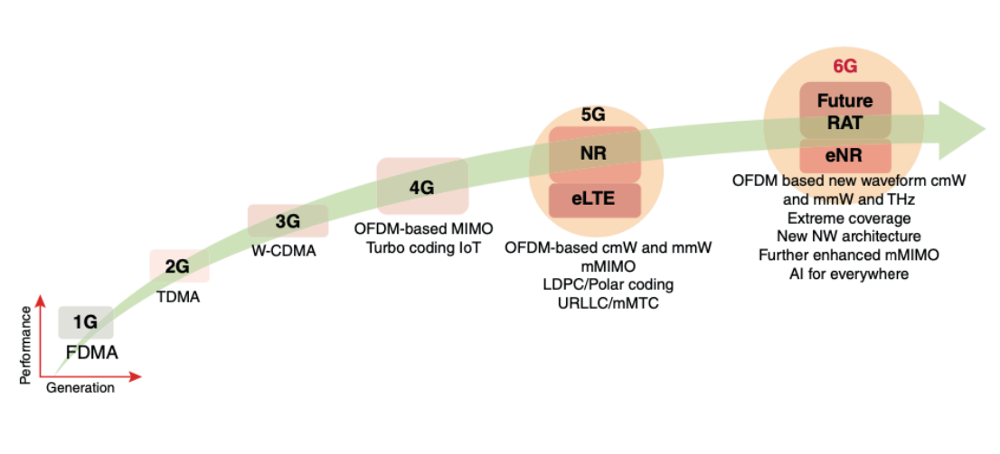
- 1G : analog voice services using FDMA
- 2G : digital voice services with TDMA
- 3G : enhanced data rates  with W-CDMA for mobile internet and multimedia
- 備註：
    - FDMA 是每個使用者會得到不同的頻段，會浪費頻寬在 guard bands 上，會隨使用者的提升，降低所收到的頻段大小
    - TDMA 是分享所有的頻段，但是每個使用者在不同的時間使用，比起 FDMA 更有效率，但也增加延遲
    - CDMA 是所有使用者分享頻段和時間，將時間和頻段分為二維變數，分配格子的方式進行分配，比起上述兩種更有效率也更為複雜
- 4G : improved data rates amd efficiency with OFDM and MIMO for IP-based communication
- 5G : use milimeter waves for higher data rates and introduce URLLC and mMTC for IoT applications
- 備註：
    - OFDMA 的核心概念是將頻道細分為多個 subcarrier ，讓不同設備能夠同時傳輸數據，不像傳統的 OFDM 一次只能服務一個設備，技術細節如下：
        - 頻譜分配：（occupies 15 kHz）將頻道劃分為 RU ，每個 RU 包含一定數量的子載波，每個子載波能獨立 modulate ，並根據設備分配不同大小
        - 多設備並行傳輸：不同設備可以在同一時間使用不同的 RU
        - 降低延遲：因可以同時傳輸，提升 peak-to-average power ratio (PAPR)，譨顯著降低網路延遲
        - 提升頻寬利用率：更有效利用頻譜資源，減少頻寬浪費
        - 應用：Downlink (DL) transmissions in LTE and 5G
    - SC-FDMA 主要用於 LTE 上行鏈路，它是 OFDMA（正交頻分多址） 的改進版本，旨在降低 峰值/平均功率比（PAPR），提升移動設備的功率效率。技術特點如下：
        - DFT-S-OFDM：SC-FDMA 在 OFDMA 的基礎上增加了 離散傅立葉變換（DFT），使得信號在頻域擴展後再進行 IFFT（逆傅立葉變換），從而形成單載波特性。
        - 降低 PAPR：相比 OFDMA，SC-FDMA 的 PAPR 更低，使得移動設備在發射信號時能夠更有效地利用功率，延長電池壽命。
        - 子載波分配方式：
            - Localized FDMA（LFDMA）：每個用戶分配一段連續的子載波。
            - Distributed FDMA（DFDMA）：每個用戶分配不連續的子載波，其中 IFDMA（交錯 FDMA） 是其特例。
    - PAPR 高的影響：
        - 功率放大器效率：高 PAPR 會迫使功率放大器（PA）進入非線性區域，導致信號畸變和頻譜擴展。
        - 能源消耗：移動設備需要更高的功率來處理高 PAPR 信號，影響電池壽命。
        - 誤碼率（BER）：高 PAPR 可能會增加誤碼率，影響通訊品質。
    - 單載波好處：
        - 降低峰值/平均功率比（PAPR）
            - 減少功率放大器的非線性失真：高 PAPR 會導致功率放大器（PA）進入非線性區域，影響信號品質。單載波技術能降低 PAPR，使功率放大器更高效運作。
            - 提升移動設備的功率效率：較低的 PAPR 讓手機等移動設備能更有效地利用電池電量，延長續航時間。

        - 增強抗多重路徑干擾能力
            - 減少符號間干擾（ISI）：多載波技術（如 OFDM）容易受到多重路徑效應影響，而單載波技術透過均衡技術（如 DFE）能更有效地減少 ISI。
            - 適合高速移動環境：在高速移動場景（如高鐵、飛機），單載波技術能更穩定地維持信號品質。

        - 簡化接收端的均衡處理
            - 降低計算複雜度：相比 OFDM 需要使用頻域均衡，單載波技術可以使用時域均衡（如 DFE），減少計算負擔。
            - 減少硬體成本：簡化的均衡技術能降低設備的處理需求，使接收端設計更簡單。
        - 適用於上行傳輸
            - LTE 上行鏈路使用 SC-FDMA：LTE 的上行鏈路採用 SC-FDMA（單載波頻分多址），因為它能降低 PAPR，提升移動設備的功率效率。
            - 提升頻譜利用率：單載波技術能更有效地利用頻譜資源，適合高效能通訊系統。
- 6G : explore higher frequency bands, including terahetz, promising extreme capacities and coverage amd significant enhancements in mMIMO and AI integration
## Key enhancements in 6G
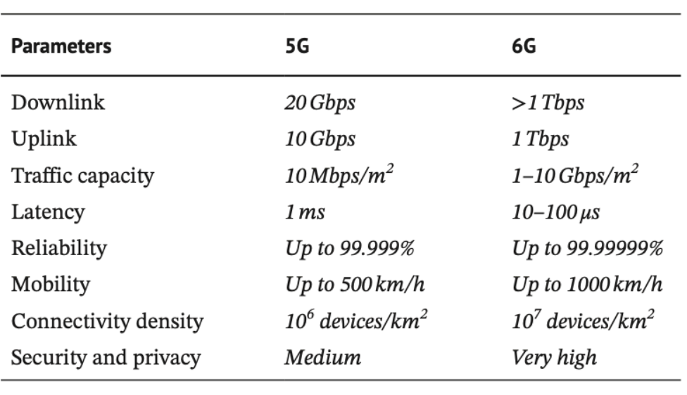
## 6G ecosystem
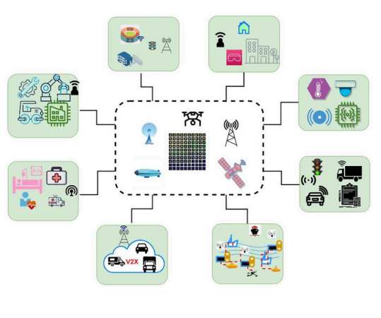
- 6G leverages AI, ultra-fast wireless, and satellites to
enhance automation, efficiency, and real-time data across
industries
- Smart cities : AI-driven urban management, smart homes,IoT-based infrastructure.
- Industry 4.0 : Automated manufacturing, robotics, edge computing.
- healthcare : Remote surgery, AI diagnostics, real-time health monitoring.
- V2X : Autonomous driving, V2V & V2I communication.
- IoT : Smart sensors, environmental monitoring, connected devices.
- Logistics & transportation : Automated supply chains, drone delivery, smart warehouses.
- Personal devices & communication  : AR/VR, ultra-fast mobile networks, nextgen devices.
- Maritime & aeronautical :  Smart shipping, satellite-based air traffic control.
## 6G advancement
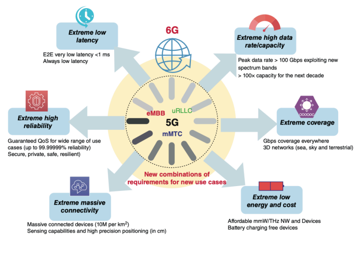
- Extreme low latency : latency < 1ms, ensuring real-time data transfer
- Extreme high data rate/capacity : peak rate > 100 Gbps, utilizing new spectrum bands and 100x capacity increased compared with 5G
- Extreme coverage : expands to 3D network (land, sea, sky, space)
- Extreme high reliability : 99.99999%
- Extreme massive connectivity : 10M connected device/km^2
- Extreme low energy & cost : affordable mmWave/THz network. and battery-free device charging innovations
- 備註： Battery-free device charging 是一種新興技術，目的在讓設備在沒有傳統電池的情況下獲取能量並運行。這類技術通常依賴於 無線能量傳輸 或 環境能量收集，像是：
    - 無線充電技術：透過電磁感應或磁共振，設備可以從充電基座獲取能量，不需要內建電池
    - 射頻能量收集：設備可以從周圍的WiFi, bluetooth, 訊號中獲取輕微電力，並用於低功耗運行
    - 太陽能充電：透過染料敏化太陽電池或高效能光伏技術，設備可在室外或戶外環境下持續獲取能量
## 6G vision
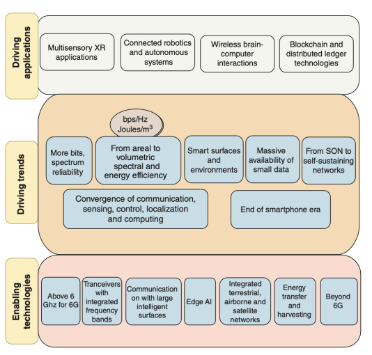  
- driving application 
    - multisensory XR applications : advanced extended reality (XR) with immersive interactions (multiple senses)
    - connected robotics & autonomous systems : AI-powered autonomous robots and automation
    - wireless brain-computer interactions :  brain-machine communication expands human capacity by merging biology and technology
    - blockchain & distributed ledger technology : decentralized, secure, and transparent digital transactions
- driving trends
    - more bits, spectrum reliability : increased data capacity and stable spectrum usage
    - from 2D to 3D spectral & energy effeciency : B5G(beyond 5G) and 6G networks optimizes frequency and power resources for 3D coverage
    - smart surfaces & environments : intelligent surfaces for better signal propagation and energy efficiency
    - massive availability of small data : optimize real-time processing and edge AI inference
    - from SON to self-sustaning networks : evolution from SON to AI-driven autonomous network
    - 備註： SON 是自動化技術，旨在簡化行動無線電存取網路的規劃、配置、管理、優化和修復。SON能夠自我配置和自我優化，減少人工干預，提高網路效率。像是高通的Wi-Fi SON，它能夠自動設置、管理和修復網路，確保設備之間的最佳連接。而從 SON 到 AI 的演進，代表著從規則式自動化轉向智慧型、自學習系統。SON技術最早在3GPP Release 8中提出，主要用於自我配置、自我修復、自我優化，以減少網路管理的複雜性。然而，由於供應商碎片化和整合挑戰，SON的普及度有限。AI驅動的自主網路則進一步提升SON的能力，透過機器學習（ML）和人工智慧（AI），實現即時決策、預測分析和意圖驅動的自動化。這些網路能夠自我適應、自我優化、自我學習，無需人工干預，對於5G和未來6G的部署至關重要。
    - covergence of communication, sensing, control. localization & computing : seamless integration of multiple technology
    - end of the smartphone era : shift to new human-machine interfaces beyond traditional mobile devices
- enabliing technology 
    - above 6 GHz for 6G : utilizing higher frequency bands for increased capacity
    - tranceivers with integrated frequency bands : efficient multi-band signal transmission
    - communication with large intelligent surfaces : enhancing signal reflection and transmission via smart surfaces
    - RIS 稱作可重構智慧表面。是一種新興的無線通訊技術，旨在控制和優化無線信號的傳播，特別適用於5G和未來6G網路。RIS主要分為被動RIS（Passive RIS）和主動RIS（Active RIS），兩者在能耗、成本和信號增強方面有所不同
        - 被動 RIS（Passive RIS）：
            - 節能且成本低，因為它僅反射信號，不進行放大
            - 適用於短距離和室內環境
            - 由於不具備放大功能，當信號強度較弱，增益效果有限
        - 主動 RIS(Active RIS) : 
            - 能夠放大信號，適用於長距離傳輸或弱信號環境
            - 功耗較高，成本較高，因需要額外的電子元件來進行信號放大
            - 在遠距離通訊傳輸或高頻毫米波傳輸時，主動 RIS 能夠顯著提升系統性能
    - edge AI : on device AI processing for low-latency applications
    
    -  integrared terrestrial, airborne & satellite network : seamless global connectivity
    - energy transfer & harvesting : wireless power transmission enables devices to operate sustainably by remotelt supplying energy
    - beyond 6G : explore future advancements beyonds the 6G fraemwork
## 6G Taxonomy
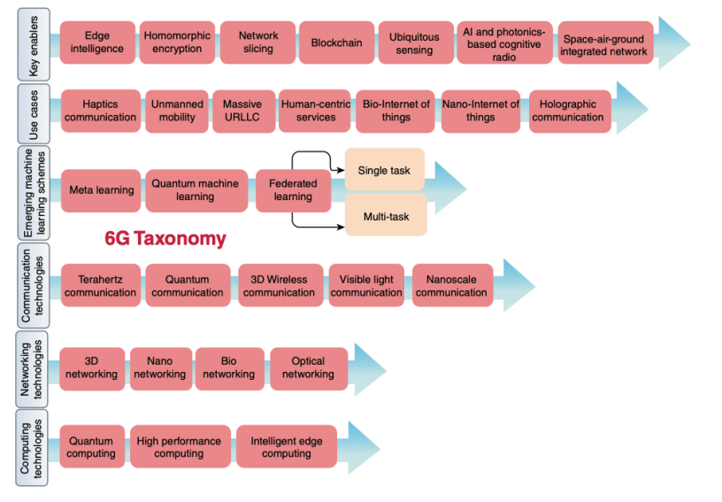
- key enablers 
    - edge intelligence : AI-powered real-time data processing at the network edge
    - homomorphic encryption : allows computations directly on encrypted data without decrypting it,preserving data privacy. 
    - network slicing : virtualized, dedicated network segments for different applications
    - 備註：5G 和 6G 皆有 network slicing 但是是有區別的：
        - 5G 中的Network Slicing
            - 主要應用：5G網路切片主要用於智慧城市、工業物聯網（IIoT）、自動駕駛、遠距醫療等場景。
            - 技術架構：5G核心網路（5GC）透過軟體定義網路（SDN）和網路功能虛擬化（NFV）
        - 6G 中的Network Slicing
            - 進一步優化：6G將進一步提升切片的智能化與自適應能力，並結合AI驅動的自主網路來動態調整切片資源。
            - 新技術融合：6G可能會整合量子通訊、區塊鏈安全機制，確保切片的隱私與安全性。
            - 應用場景擴展：6G的網路切片將支持全息通訊、腦機介面、太空通訊等新興技術。
    - blockchain : decentralized security and trust mechanisms
    - ubiquitous sensing : seamless environmental awareness and data collection
    - AI & photonic-based cognitive radio : optical communication offload high-bandwidth data, easing congestion and improving wireless spectrum effciency
    - space-air-ground integrated network : global coverage via satellite, airborne, terrestrial network
- use cases
    - haptics communication : transmit information via touch-based feedback, enabling physical interaction in VR, AR, telemedicine, and remote robotics
    - unmanned mobility : AI-driven autonomous vehicles and drones
    - massive URLLC :　ultra-reliable low-latency communications for critical applications
    - human-centric services : personalized service tailored by AI
    - bio-internet of things : use devices to analyze biological data from living organisms or biological processes
    - nano-intenet of things : integration of nano-scale devices with IoT for precise sensing, data collection, and communication
    - holographic communication : 3D real-time holography for immersive telepresence
- emerging machine-learning schemes 
    - meta learning : AI models that learn how to learn efficiently
    - quantum machine learning : quantum computing-based AI models for ultra-fast processing 
    - federated learning : decentralized AI training for single-task and multi-task optimizations
- communication technology 
    - terahertz communication : ultra-high frequency : spectrum for fast speeds
    - quantum communication : quantum-based ultra-secure data transmission
    - 3D wireless communication : multi-dimensional connectivity
    - visible light communication (VLC) :optical-based wireless communication
    -  nanoscale communication : data exchange between micro/nano scale devices
- networking technology 
    - 3D networking : integrated air, space, and terrestrial networks
    - nano networking : enabling precise molecular or ultra-high-frequency interactions; apllication : medical diagnostics, cellular-level health monitoring, environmental sensing
    - bio networking : networking within biological systems for medical applications
    - optical networking : high-speed, fiber-optic-based connectivity
- computing technology
    - quantum computing : exploring quantum mechanics for superior processing power
    - high-performance computing : large-scale computing for AI and simulations
    - intelligent edge computing : AI-driven processing at the network edge for real-time insights
## 6G potential and challenges beyond 100 GHz frequency
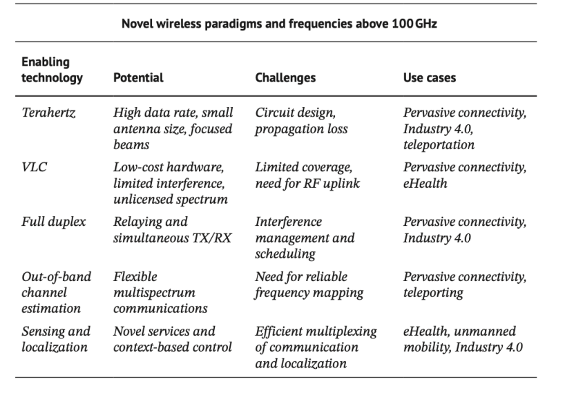
- terahertz communication 
    - potential : high data rates, small antennas, focused beams
    - challenges : circuit design complexities, propagation loss
    - use cases : pervasive connectivity, industry 4.0, teleportation
    - example : Tera-WiFi, Tera-IoT, Tera-IAB, Tera-SpaceCom
- visible light communication (VLC) 
    - potential : low-cost HW, reduced interference, unlicensed spectrum
    - challenge : limited coverage, require RF uplink
    - use cases : pervasive connectivity, eHealth
    - VLC system technology : 簡單來說，就是透過 LED 燈發送數據，並用光電探測器接收信號：
        - 傳輸端（TX）：數位數據經過調變與誤差校正，再由 DAC 轉換為類比信號，透過 LED 驅動器控制 LED 快速閃爍，將數據編寫成光信號
        - 接收端（RX）：光電二極體（photodiode）偵測光信號，TIA 放大轉換為電壓，再透過 ADC 轉換為數位數據，最後進行解碼，還原原始資訊 
- full duplex communication 
    - simultaneous transmission and reception : 6G enables true full-duplex, allowing bidirectional communication on the same frequency
    - enhanced efficiency : reduces latency and optimizes spectrum use with continuous communication
    - advanced technology : utilizes AI, beamforming, and new standard
    - key benefits :  improves real-time interactions, lowers latency, and increase 6G throughput for applications
- out-of-band channel estimation
    - in-band & out-band 
        - in-band : control messages share the same channel as regular data.
        - out-band : control messages use separate, dedicated links.
    - potential : supports flexible multi=spectrum communications
    - challenges : require reliable frequency mapping
    - use cases : pervasive connectivity, teleporting
- sensing and localization :
    - active & passive sensing : 
        - active : emits signal to detect positions and movement
        - passive : use existing signals in the environmemt to sense object without dedicated tranmission
    - intelligient reflective surface (IRS) : dynamically redirects wireless signals to improve coverage and localization accuracy
    - beamspace processing : focuses signals into directed beams, enhancing sensing resolution and communication efficiency
    - AI-driven coordination : AI analyze sensing data, adapting beans and network resouces for precise, real-time tracking 
        - potential : enables novel services and context-based control
        - challenges : efficient multiplexing of communication and localization
        - use cases : eHealth, unmanned mobility, industry 4.0
## 6G potential and challenges in network architecture
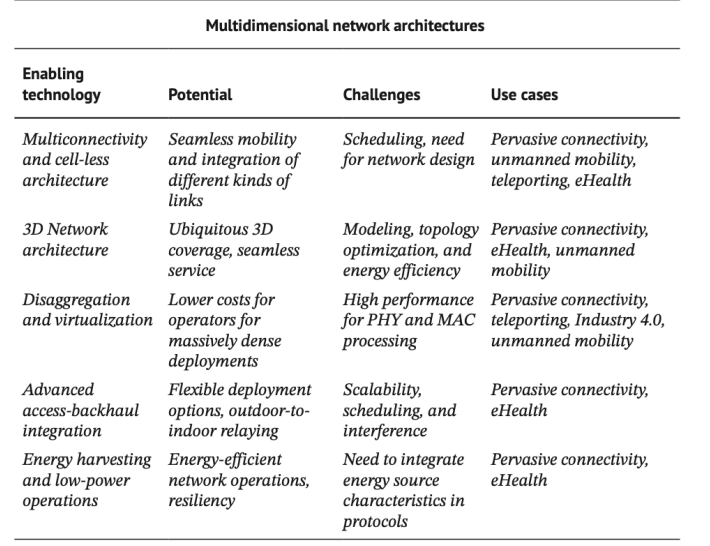
- multiconnectivity & cell-less architecture
    - extreme multi-conectivity : devices use multiple frequency bands simultaneously for higher reliability and throughput
    - cell-less architecture : network connects the device to the entire RAN, allowing seamless shifting among available links without fixed cell boundries
    - potential : seamless mobility, integration of diverse links
    challenges : scheduling, complex network design
    use case : pervasive connectivity, umanned mobility, teleporting, eHealth
- 3D network architecture 
    - potential : ubiquitous 3D coverage, seamless service
    - challenge : topology (3D) optimization, energy efficiency
    - use case : pervasive connectivity, eHealth, unmanned mobility
- disaggregation & virtualization 
    - disaggregation : network function are broken down into separate modules and run on general-purpose HW
    - virtualization : functions move from dedicated HW appliances to SW based services, whcih can run in different clouds
    - orchestration : an orchestration SW layer automatically determines where and how to run each network function, scaling resources as needed to maxmize efficiency and reduce energy consumption
    - potential : lower deployment costs for dense networks
    - challenge : high-performance processing for PHY & MAC layer 
    use cases : percasive connectivity, teleporting, industry 4.0, ummaned mobility
- advanced access-baclhaul integration : unifies access and backhaul into a dynamic system. reducing latency and optimizing resouces
    - example : 
        - IAB donor(central/base station) : connected to the core network and relays data to/from downstream IAB nodes
        - IAB nodes : small cell that wirelessly receive backhaul from the donor and provide access links to users
        - wireless backhaul link : carries network traffic between the donor and IAB nodes via radio waves
        - access link : connects IAB nodes to end-user device for regular cellular or broadband service
    - potnetial : flexible deploymentm ourdoor-to-indoor relaying
    - challenges : scalability, scheduling, interference
    - use cases : pervasive connectivity, eHealth
- energy harvesting & low-power operations 
    - energy harvesting : devices capture ambient energy  to reduce battery reliance
    - low-power operations : utilize ultra-efficient HW and protocols to reduce energy consumption and extend operation
    - potential : energy-efficient networks, improved resiliency
    - challenge : integrating energy source characteristic in protocols
    - use case : pervasive connectivity, eHealth
    - example : 
        - energy harvesting sources : solar panels and wind turbines supply power to the network infrastructure, minimizing reliance on the electrical grid
        - hybrid power supply : combines renewable energy with grid power for reliable operation
        - access points & fronthaul : APs connect uesrs to the network, using harvested energy for efficient data transmission
        - fronthaul link : connects the APs tp a central processing unit, optimizing data transmission while utilzing harvested energy
        - backhaul connectivity : links APs to the core network, ensuring low-power. high-efficiency operations
## Four-layer 6G network architecture
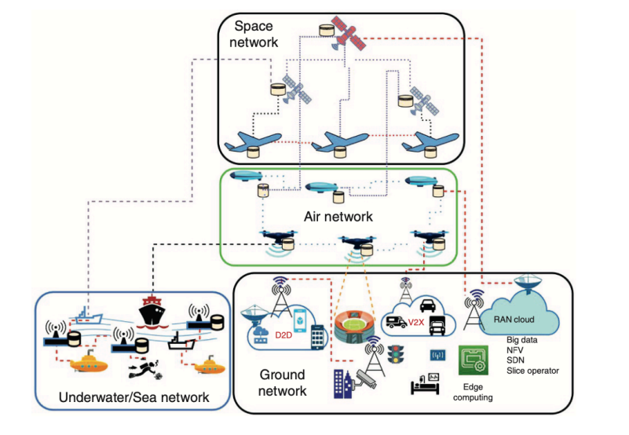
- space-network tier : 
    - involve satellites and space assets
        - utilized for wide-area and global connectivity
    - connect with air and ground layers
        - integration for intefgrated and uninterrupred network service
- air-network tier : 
    - consist of drones or UAVs
        - provide connectivity
        - act as relays between ground and space layers
    - enhanced ground network coverage
        - paricularly in dense or remote areas
- terrestrial-network tier : 
    - include V2X and D2D communications
    - incorporate edge computing
        - aimed at reducing latency and efficient network management
    - include technology : 
        - big data
        - NFV
        - SDN
        - network slicing
- underwater network tier : 
    - focus on underwater communications
        - involve submersibles, sensors, and ship
    - utilize acoustic communication
        - due to the attenuation and scattering of eletromagnectic signals in water
        - use sound waves for data transmission 
## Terahertz communication
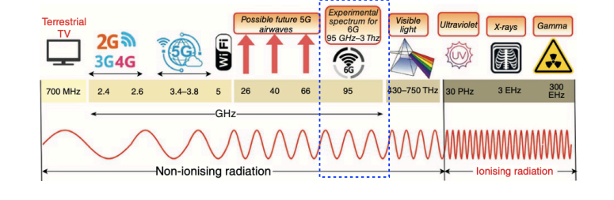
- terahertz spectrum 
    - span 100 GHz to 3THz
    - offer extensive bandwidth for 6G networks
- sub-THz range
    - renage between 100-300 GHz
    - suitable for high-gain antennas and secure communication
- application : include wireless cognition, high-speed data, and percise positioning
- challenge : require reliable high-speed data transmission for critical applications
- advantage : low interference, high-frequency transmission, significant antenna integration potnetial
## Visible light communication
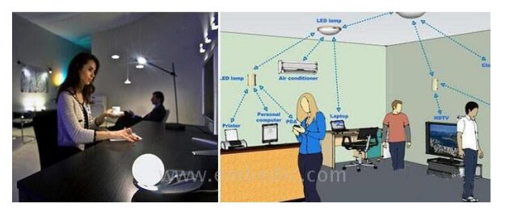
- VLC : is an optical wireless communication(OWC) technology that utilizes visible light to transmit data
- VLC is a subset of OWC and is often considered a complementary technology to traditional RF-based wireless communication
- OWC advantage :
    - multi-gigabit data rates
    - license-free bandwidth usage
    - secure, narrow-beam communication
    - resilience to electromagnetic noise
    - simplified installation process
    - useful in disater recovery and as a Wi-Fi alternative
- challenges in OWC : 
    - weather impact : wind, vibration, or changes in atmospheric condictions
    - alignment issues : 
        - LOS(light-of-sight) : challenges due to physical obstructions, atmospheric condictions
        - mobility : ensuring stable connections and percise alignment in dynamic environmenrt
        - precision : the need for highly accurate pointing and tracking for reliable communication
    - far-infrared light : atmospheric absorption and scattering
    - dual-laser signaling : synchronize lasers, minimize interference, maintain beam alignment, and handle atmospheric effects
    - extended application : 
        - OWC useful in satellite communications
        - achieved significant data rates between the Moon and Earth
## RF vs. OWC
- spectrum 
    - RF use radio waves ranging from kHz to GHz
    - OWC use light waves, including infrared, visible, and ultraviolet light
- regulation
    - RF operates in regulated spectrum, which can lead to congestion
    - OWC use an umregulated spectrum, which is less congested
- range 
    - RF has a long range, from meters to kilometers
    - OWC has a sorter range, typicallu form a few meters to kilometers depending on the application
- security 
    - RF is susceptible to interference and is less secure
    - OWC offers high securuty due to the line-og-sight requirement
- data rates 
    - RF can support data rates up to tens of Gbps
    - OEC can support data rates up to hundreds of Gbps. with the potential for even higher speeds
- scalability
    - RF has limited scalability due to spectrum congestion
    - OWC is highly scalable because it uses an unregulated spectrum
- weather dependence
    - RF is less affected by weather conditions
    - OWC can be affected by environmental factors such as fog, rain, and snow
- cost
    - RF system usually have a lower initial cost due to simpler, widely available HW
    - OWC can be more expensive because it requires specialized, less standardized components like high-precision optics and light-based transmitters
- 備註：頻譜以及頻寬
    - 頻譜：指電磁波的整體頻率範圍，包括無線電波、微波、紅外線、可見光等。例如，無線電頻譜涵蓋3 kHz 到 300 GHz，而光學頻譜則在更高頻率範圍。
    - 頻寬： 指一個特定通訊系統可用的頻率範圍，影響數據傳輸速率。例如，Wi-Fi 6 的頻寬可能是160 MHz，表示設備可用的頻率範圍。頻寬越大，數據傳輸速度越快（例如5G比4G有更大的頻寬，因此速度更快）。
    - 比喻：如果頻譜是高速公路，那麼頻寬就是道路的寬度：
        - 頻譜：高速公路的總長度（所有可能的道路）
        - 頻寬：某條道路的寬度（可同時行駛的車輛數量）
## Optical communication
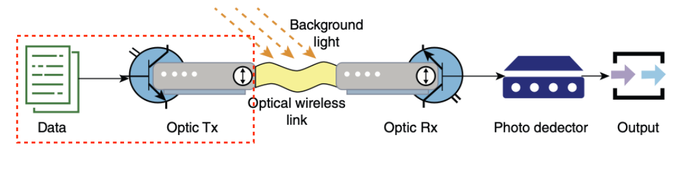
- data generation : electronic data initiation
- optical transmitter(optic Tx) : convert eletronic data into optical signals using lasers or LEDs
- optical wireless link : transmit the optical signal, potential affected by background light interference
- optical receiver(optic Rx) : capture the light signal and convert it back into eletronic form
- photo detector : a crucial component of the optic receiver, converting light to electrical signals
- output : process the electronic signal to reconstruct and utilize the transmitted data
## OWC for mobile backhaul
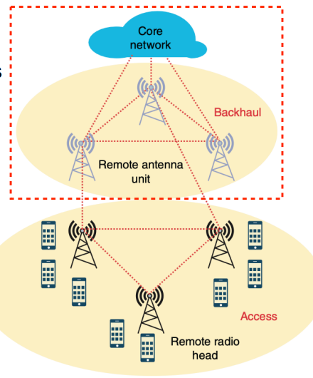
- 

