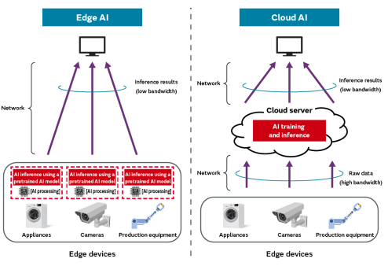
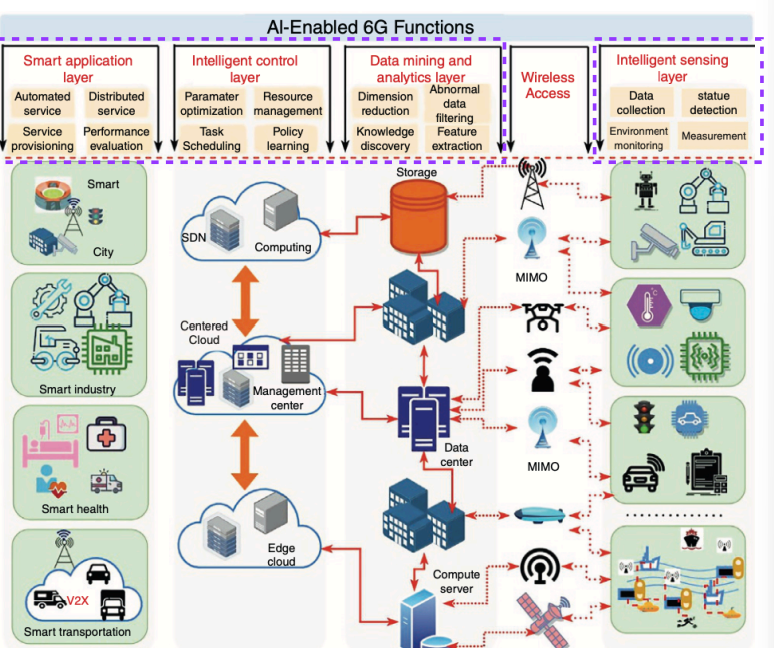

# 6G mobile communication

## Evolution to 6G

- 1G : analog voice services using FDMA
- 2G : digital voice services with TDMA
- 3G : enhanced data rates  with W-CDMA for mobile internet and multimedia
- 備註：
    - FDMA 是每個使用者會得到不同的頻段，會浪費頻寬在 guard bands 上，會隨使用者的提升，降低所收到的頻段大小
    - TDMA 是分享所有的頻段，但是每個使用者在不同的時間使用，比起 FDMA 更有效率，但也增加延遲
    - CDMA 是所有使用者分享頻段和時間，將時間和頻段分為二維變數，分配格子的方式進行分配，比起上述兩種更有效率也更為複雜
- 4G : improved data rates amd efficiency with OFDM and MIMO for IP-based communication
- 5G : use milimeter waves for higher data rates and introduce URLLC and mMTC for IoT applications
- 備註：
    - OFDMA 的核心概念是將頻道細分為多個 subcarrier ，讓不同設備能夠同時傳輸數據，不像傳統的 OFDM 一次只能服務一個設備，技術細節如下：
        - 頻譜分配：（occupies 15 kHz）將頻道劃分為 RU ，每個 RU 包含一定數量的子載波，每個子載波能獨立 modulate ，並根據設備分配不同大小
        - 多設備並行傳輸：不同設備可以在同一時間使用不同的 RU
        - 降低延遲：因可以同時傳輸，提升 peak-to-average power ratio (PAPR)，譨顯著降低網路延遲
        - 提升頻寬利用率：更有效利用頻譜資源，減少頻寬浪費
        - 應用：Downlink (DL) transmissions in LTE and 5G
    - SC-FDMA 主要用於 LTE 上行鏈路，它是 OFDMA（正交頻分多址） 的改進版本，旨在降低 峰值/平均功率比（PAPR），提升移動設備的功率效率。技術特點如下：
        - DFT-S-OFDM：SC-FDMA 在 OFDMA 的基礎上增加了 離散傅立葉變換（DFT），使得信號在頻域擴展後再進行 IFFT（逆傅立葉變換），從而形成單載波特性。
        - 降低 PAPR：相比 OFDMA，SC-FDMA 的 PAPR 更低，使得移動設備在發射信號時能夠更有效地利用功率，延長電池壽命。
        - 子載波分配方式：
            - Localized FDMA（LFDMA）：每個用戶分配一段連續的子載波。
            - Distributed FDMA（DFDMA）：每個用戶分配不連續的子載波，其中 IFDMA（交錯 FDMA） 是其特例。
    - PAPR 高的影響：
        - 功率放大器效率：高 PAPR 會迫使功率放大器（PA）進入非線性區域，導致信號畸變和頻譜擴展。
        - 能源消耗：移動設備需要更高的功率來處理高 PAPR 信號，影響電池壽命。
        - 誤碼率（BER）：高 PAPR 可能會增加誤碼率，影響通訊品質。
    - 單載波好處：
        - 降低峰值/平均功率比（PAPR）
            - 減少功率放大器的非線性失真：高 PAPR 會導致功率放大器（PA）進入非線性區域，影響信號品質。單載波技術能降低 PAPR，使功率放大器更高效運作。
            - 提升移動設備的功率效率：較低的 PAPR 讓手機等移動設備能更有效地利用電池電量，延長續航時間。

        - 增強抗多重路徑干擾能力
            - 減少符號間干擾（ISI）：多載波技術（如 OFDM）容易受到多重路徑效應影響，而單載波技術透過均衡技術（如 DFE）能更有效地減少 ISI。
            - 適合高速移動環境：在高速移動場景（如高鐵、飛機），單載波技術能更穩定地維持信號品質。

        - 簡化接收端的均衡處理
            - 降低計算複雜度：相比 OFDM 需要使用頻域均衡，單載波技術可以使用時域均衡（如 DFE），減少計算負擔。
            - 減少硬體成本：簡化的均衡技術能降低設備的處理需求，使接收端設計更簡單。
        - 適用於上行傳輸
            - LTE 上行鏈路使用 SC-FDMA：LTE 的上行鏈路採用 SC-FDMA（單載波頻分多址），因為它能降低 PAPR，提升移動設備的功率效率。
            - 提升頻譜利用率：單載波技術能更有效地利用頻譜資源，適合高效能通訊系統。
- 6G : explore higher frequency bands, including terahetz, promising extreme capacities and coverage amd significant enhancements in mMIMO and AI integration
## Key enhancements in 6G

## 6G ecosystem

- 6G leverages AI, ultra-fast wireless, and satellites to
enhance automation, efficiency, and real-time data across
industries
- Smart cities : AI-driven urban management, smart homes,IoT-based infrastructure.
- Industry 4.0 : Automated manufacturing, robotics, edge computing.
- healthcare : Remote surgery, AI diagnostics, real-time health monitoring.
- V2X : Autonomous driving, V2V & V2I communication.
- IoT : Smart sensors, environmental monitoring, connected devices.
- Logistics & transportation : Automated supply chains, drone delivery, smart warehouses.
- Personal devices & communication  : AR/VR, ultra-fast mobile networks, nextgen devices.
- Maritime & aeronautical :  Smart shipping, satellite-based air traffic control.
## 6G advancement

- Extreme low latency : latency < 1ms, ensuring real-time data transfer
- Extreme high data rate/capacity : peak rate > 100 Gbps, utilizing new spectrum bands and 100x capacity increased compared with 5G
- Extreme coverage : expands to 3D network (land, sea, sky, space)
- Extreme high reliability : 99.99999%
- Extreme massive connectivity : 10M connected device/km^2
- Extreme low energy & cost : affordable mmWave/THz network. and battery-free device charging innovations
- 備註： Battery-free device charging 是一種新興技術，目的在讓設備在沒有傳統電池的情況下獲取能量並運行。這類技術通常依賴於 無線能量傳輸 或 環境能量收集，像是：
    - 無線充電技術：透過電磁感應或磁共振，設備可以從充電基座獲取能量，不需要內建電池
    - 射頻能量收集：設備可以從周圍的WiFi, bluetooth, 訊號中獲取輕微電力，並用於低功耗運行
    - 太陽能充電：透過染料敏化太陽電池或高效能光伏技術，設備可在室外或戶外環境下持續獲取能量
## 6G vision
  
- driving application 
    - multisensory XR applications : advanced extended reality (XR) with immersive interactions (multiple senses)
    - connected robotics & autonomous systems : AI-powered autonomous robots and automation
    - wireless brain-computer interactions :  brain-machine communication expands human capacity by merging biology and technology
    - blockchain & distributed ledger technology : decentralized, secure, and transparent digital transactions
- driving trends
    - more bits, spectrum reliability : increased data capacity and stable spectrum usage
    - from 2D to 3D spectral & energy effeciency : B5G(beyond 5G) and 6G networks optimizes frequency and power resources for 3D coverage
    - smart surfaces & environments : intelligent surfaces for better signal propagation and energy efficiency
    - massive availability of small data : optimize real-time processing and edge AI inference
    - from SON to self-sustaning networks : evolution from SON to AI-driven autonomous network
    - 備註： SON 是自動化技術，旨在簡化行動無線電存取網路的規劃、配置、管理、優化和修復。SON能夠自我配置和自我優化，減少人工干預，提高網路效率。像是高通的Wi-Fi SON，它能夠自動設置、管理和修復網路，確保設備之間的最佳連接。而從 SON 到 AI 的演進，代表著從規則式自動化轉向智慧型、自學習系統。SON技術最早在3GPP Release 8中提出，主要用於自我配置、自我修復、自我優化，以減少網路管理的複雜性。然而，由於供應商碎片化和整合挑戰，SON的普及度有限。AI驅動的自主網路則進一步提升SON的能力，透過機器學習（ML）和人工智慧（AI），實現即時決策、預測分析和意圖驅動的自動化。這些網路能夠自我適應、自我優化、自我學習，無需人工干預，對於5G和未來6G的部署至關重要。
    - covergence of communication, sensing, control. localization & computing : seamless integration of multiple technology
    - end of the smartphone era : shift to new human-machine interfaces beyond traditional mobile devices
- enabliing technology 
    - above 6 GHz for 6G : utilizing higher frequency bands for increased capacity
    - tranceivers with integrated frequency bands : efficient multi-band signal transmission
    - communication with large intelligent surfaces : enhancing signal reflection and transmission via smart surfaces
    - RIS 稱作可重構智慧表面。是一種新興的無線通訊技術，旨在控制和優化無線信號的傳播，特別適用於5G和未來6G網路。RIS主要分為被動RIS（Passive RIS）和主動RIS（Active RIS），兩者在能耗、成本和信號增強方面有所不同
        - 被動 RIS（Passive RIS）：
            - 節能且成本低，因為它僅反射信號，不進行放大
            - 適用於短距離和室內環境
            - 由於不具備放大功能，當信號強度較弱，增益效果有限
        - 主動 RIS(Active RIS) : 
            - 能夠放大信號，適用於長距離傳輸或弱信號環境
            - 功耗較高，成本較高，因需要額外的電子元件來進行信號放大
            - 在遠距離通訊傳輸或高頻毫米波傳輸時，主動 RIS 能夠顯著提升系統性能
    - edge AI : on device AI processing for low-latency applications
    
    -  integrared terrestrial, airborne & satellite network : seamless global connectivity
    - energy transfer & harvesting : wireless power transmission enables devices to operate sustainably by remotelt supplying energy
    - beyond 6G : explore future advancements beyonds the 6G fraemwork
## 6G Taxonomy

- key enablers 
    - edge intelligence : AI-powered real-time data processing at the network edge
    - homomorphic encryption : allows computations directly on encrypted data without decrypting it,preserving data privacy. 
    - network slicing : virtualized, dedicated network segments for different applications
    - 備註：5G 和 6G 皆有 network slicing 但是是有區別的：
        - 5G 中的Network Slicing
            - 主要應用：5G網路切片主要用於智慧城市、工業物聯網（IIoT）、自動駕駛、遠距醫療等場景。
            - 技術架構：5G核心網路（5GC）透過軟體定義網路（SDN）和網路功能虛擬化（NFV）
        - 6G 中的Network Slicing
            - 進一步優化：6G將進一步提升切片的智能化與自適應能力，並結合AI驅動的自主網路來動態調整切片資源。
            - 新技術融合：6G可能會整合量子通訊、區塊鏈安全機制，確保切片的隱私與安全性。
            - 應用場景擴展：6G的網路切片將支持全息通訊、腦機介面、太空通訊等新興技術。
    - blockchain : decentralized security and trust mechanisms
    - ubiquitous sensing : seamless environmental awareness and data collection
    - AI & photonic-based cognitive radio : optical communication offload high-bandwidth data, easing congestion and improving wireless spectrum effciency
    - space-air-ground integrated network : global coverage via satellite, airborne, terrestrial network
- use cases
    - haptics communication : transmit information via touch-based feedback, enabling physical interaction in VR, AR, telemedicine, and remote robotics
    - unmanned mobility : AI-driven autonomous vehicles and drones
    - massive URLLC :　ultra-reliable low-latency communications for critical applications
    - human-centric services : personalized service tailored by AI
    - bio-internet of things : use devices to analyze biological data from living organisms or biological processes
    - nano-intenet of things : integration of nano-scale devices with IoT for precise sensing, data collection, and communication
    - holographic communication : 3D real-time holography for immersive telepresence
- emerging machine-learning schemes 
    - meta learning : AI models that learn how to learn efficiently
    - quantum machine learning : quantum computing-based AI models for ultra-fast processing 
    - federated learning : decentralized AI training for single-task and multi-task optimizations
- communication technology 
    - terahertz communication : ultra-high frequency : spectrum for fast speeds
    - quantum communication : quantum-based ultra-secure data transmission
    - 3D wireless communication : multi-dimensional connectivity
    - visible light communication (VLC) :optical-based wireless communication
    -  nanoscale communication : data exchange between micro/nano scale devices
- networking technology 
    - 3D networking : integrated air, space, and terrestrial networks
    - nano networking : enabling precise molecular or ultra-high-frequency interactions; apllication : medical diagnostics, cellular-level health monitoring, environmental sensing
    - bio networking : networking within biological systems for medical applications
    - optical networking : high-speed, fiber-optic-based connectivity
- computing technology
    - quantum computing : exploring quantum mechanics for superior processing power
    - high-performance computing : large-scale computing for AI and simulations
    - intelligent edge computing : AI-driven processing at the network edge for real-time insights
## 6G potential and challenges beyond 100 GHz frequency

- terahertz communication 
    - potential : high data rates, small antennas, focused beams
    - challenges : circuit design complexities, propagation loss
    - use cases : pervasive connectivity, industry 4.0, teleportation
    - example : Tera-WiFi, Tera-IoT, Tera-IAB, Tera-SpaceCom
- visible light communication (VLC) 
    - potential : low-cost HW, reduced interference, unlicensed spectrum
    - challenge : limited coverage, require RF uplink
    - use cases : pervasive connectivity, eHealth
    - VLC system technology : 簡單來說，就是透過 LED 燈發送數據，並用光電探測器接收信號：
        - 傳輸端（TX）：數位數據經過調變與誤差校正，再由 DAC 轉換為類比信號，透過 LED 驅動器控制 LED 快速閃爍，將數據編寫成光信號
        - 接收端（RX）：光電二極體（photodiode）偵測光信號，TIA 放大轉換為電壓，再透過 ADC 轉換為數位數據，最後進行解碼，還原原始資訊 
- full duplex communication 
    - simultaneous transmission and reception : 6G enables true full-duplex, allowing bidirectional communication on the same frequency
    - enhanced efficiency : reduces latency and optimizes spectrum use with continuous communication
    - advanced technology : utilizes AI, beamforming, and new standard
    - key benefits :  improves real-time interactions, lowers latency, and increase 6G throughput for applications
- out-of-band channel estimation
    - in-band & out-band 
        - in-band : control messages share the same channel as regular data.
        - out-band : control messages use separate, dedicated links.
    - potential : supports flexible multi=spectrum communications
    - challenges : require reliable frequency mapping
    - use cases : pervasive connectivity, teleporting
- sensing and localization :
    - active & passive sensing : 
        - active : emits signal to detect positions and movement
        - passive : use existing signals in the environmemt to sense object without dedicated tranmission
    - intelligient reflective surface (IRS) : dynamically redirects wireless signals to improve coverage and localization accuracy
    - beamspace processing : focuses signals into directed beams, enhancing sensing resolution and communication efficiency
    - AI-driven coordination : AI analyze sensing data, adapting beans and network resouces for precise, real-time tracking 
        - potential : enables novel services and context-based control
        - challenges : efficient multiplexing of communication and localization
        - use cases : eHealth, unmanned mobility, industry 4.0
## 6G potential and challenges in network architecture

- multiconnectivity & cell-less architecture
    - extreme multi-conectivity : devices use multiple frequency bands simultaneously for higher reliability and throughput
    - cell-less architecture : network connects the device to the entire RAN, allowing seamless shifting among available links without fixed cell boundries
    - potential : seamless mobility, integration of diverse links
    challenges : scheduling, complex network design
    use case : pervasive connectivity, umanned mobility, teleporting, eHealth
- 3D network architecture 
    - potential : ubiquitous 3D coverage, seamless service
    - challenge : topology (3D) optimization, energy efficiency
    - use case : pervasive connectivity, eHealth, unmanned mobility
- disaggregation & virtualization 
    - disaggregation : network function are broken down into separate modules and run on general-purpose HW
    - virtualization : functions move from dedicated HW appliances to SW based services, whcih can run in different clouds
    - orchestration : an orchestration SW layer automatically determines where and how to run each network function, scaling resources as needed to maxmize efficiency and reduce energy consumption
    - potential : lower deployment costs for dense networks
    - challenge : high-performance processing for PHY & MAC layer 
    use cases : percasive connectivity, teleporting, industry 4.0, ummaned mobility
- advanced access-baclhaul integration : unifies access and backhaul into a dynamic system. reducing latency and optimizing resouces
    - example : 
        - IAB donor(central/base station) : connected to the core network and relays data to/from downstream IAB nodes
        - IAB nodes : small cell that wirelessly receive backhaul from the donor and provide access links to users
        - wireless backhaul link : carries network traffic between the donor and IAB nodes via radio waves
        - access link : connects IAB nodes to end-user device for regular cellular or broadband service
    - potnetial : flexible deploymentm ourdoor-to-indoor relaying
    - challenges : scalability, scheduling, interference
    - use cases : pervasive connectivity, eHealth
- energy harvesting & low-power operations 
    - energy harvesting : devices capture ambient energy  to reduce battery reliance
    - low-power operations : utilize ultra-efficient HW and protocols to reduce energy consumption and extend operation
    - potential : energy-efficient networks, improved resiliency
    - challenge : integrating energy source characteristic in protocols
    - use case : pervasive connectivity, eHealth
    - example : 
        - energy harvesting sources : solar panels and wind turbines supply power to the network infrastructure, minimizing reliance on the electrical grid
        - hybrid power supply : combines renewable energy with grid power for reliable operation
        - access points & fronthaul : APs connect uesrs to the network, using harvested energy for efficient data transmission
        - fronthaul link : connects the APs tp a central processing unit, optimizing data transmission while utilzing harvested energy
        - backhaul connectivity : links APs to the core network, ensuring low-power. high-efficiency operations
## Four-layer 6G network architecture

- space-network tier : 
    - involve satellites and space assets
        - utilized for wide-area and global connectivity
    - connect with air and ground layers
        - integration for intefgrated and uninterrupred network service
- air-network tier : 
    - consist of drones or UAVs
        - provide connectivity
        - act as relays between ground and space layers
    - enhanced ground network coverage
        - paricularly in dense or remote areas
- terrestrial-network tier : 
    - include V2X and D2D communications
    - incorporate edge computing
        - aimed at reducing latency and efficient network management
    - include technology : 
        - big data
        - NFV
        - SDN
        - network slicing
- underwater network tier : 
    - focus on underwater communications
        - involve submersibles, sensors, and ship
    - utilize acoustic communication
        - due to the attenuation and scattering of eletromagnectic signals in water
        - use sound waves for data transmission 
## Terahertz communication

- terahertz spectrum 
    - span 100 GHz to 3THz
    - offer extensive bandwidth for 6G networks
- sub-THz range
    - renage between 100-300 GHz
    - suitable for high-gain antennas and secure communication
- application : include wireless cognition, high-speed data, and percise positioning
- challenge : require reliable high-speed data transmission for critical applications
- advantage : low interference, high-frequency transmission, significant antenna integration potnetial
## Visible light communication

- VLC : is an optical wireless communication(OWC) technology that utilizes visible light to transmit data
- VLC is a subset of OWC and is often considered a complementary technology to traditional RF-based wireless communication
- OWC advantage :
    - multi-gigabit data rates
    - license-free bandwidth usage
    - secure, narrow-beam communication
    - resilience to electromagnetic noise
    - simplified installation process
    - useful in disater recovery and as a Wi-Fi alternative
- challenges in OWC : 
    - weather impact : wind, vibration, or changes in atmospheric condictions
    - alignment issues : 
        - LOS(light-of-sight) : challenges due to physical obstructions, atmospheric condictions
        - mobility : ensuring stable connections and percise alignment in dynamic environmenrt
        - precision : the need for highly accurate pointing and tracking for reliable communication
    - far-infrared light : atmospheric absorption and scattering
    - dual-laser signaling : synchronize lasers, minimize interference, maintain beam alignment, and handle atmospheric effects
    - extended application : 
        - OWC useful in satellite communications
        - achieved significant data rates between the Moon and Earth
## RF vs. OWC
- spectrum 
    - RF use radio waves ranging from kHz to GHz
    - OWC use light waves, including infrared, visible, and ultraviolet light
- regulation
    - RF operates in regulated spectrum, which can lead to congestion
    - OWC use an umregulated spectrum, which is less congested
- range 
    - RF has a long range, from meters to kilometers
    - OWC has a sorter range, typicallu form a few meters to kilometers depending on the application
- security 
    - RF is susceptible to interference and is less secure
    - OWC offers high securuty due to the line-og-sight requirement
- data rates 
    - RF can support data rates up to tens of Gbps
    - OEC can support data rates up to hundreds of Gbps. with the potential for even higher speeds
- scalability
    - RF has limited scalability due to spectrum congestion
    - OWC is highly scalable because it uses an unregulated spectrum
- weather dependence
    - RF is less affected by weather conditions
    - OWC can be affected by environmental factors such as fog, rain, and snow
- cost
    - RF system usually have a lower initial cost due to simpler, widely available HW
    - OWC can be more expensive because it requires specialized, less standardized components like high-precision optics and light-based transmitters
- 備註：頻譜以及頻寬
    - 頻譜：指電磁波的整體頻率範圍，包括無線電波、微波、紅外線、可見光等。例如，無線電頻譜涵蓋3 kHz 到 300 GHz，而光學頻譜則在更高頻率範圍。
    - 頻寬： 指一個特定通訊系統可用的頻率範圍，影響數據傳輸速率。例如，Wi-Fi 6 的頻寬可能是160 MHz，表示設備可用的頻率範圍。頻寬越大，數據傳輸速度越快（例如5G比4G有更大的頻寬，因此速度更快）。
    - 比喻：如果頻譜是高速公路，那麼頻寬就是道路的寬度：
        - 頻譜：高速公路的總長度（所有可能的道路）
        - 頻寬：某條道路的寬度（可同時行駛的車輛數量）
## Optical communication

- data generation : electronic data initiation
- optical transmitter(optic Tx) : convert eletronic data into optical signals using lasers or LEDs
- optical wireless link : transmit the optical signal, potential affected by background light interference
- optical receiver(optic Rx) : capture the light signal and convert it back into eletronic form
- photo detector : a crucial component of the optic receiver, converting light to electrical signals
- output : process the electronic signal to reconstruct and utilize the transmitted data
## OWC for mobile backhaul

- core network 
    - central hub for managing traffic and services
    - within a mobile network
- backhaul 
    - connect cell site equipment to the core network
    - potentially utilize optical signals for high-speed data transfer
- remote antenna unit
    - positioned near end-users
    - facilitate wireless communication with devices
- remote radio head
    - process radio signals
    - communicate directly with mobile devices
    - sometimes integrated with antenna units
- access
    - local coverage area
    - devices connect to the network
    - enabled by radio access proveded by remote radio heads
## Light fidelity(LiFi)

- macro/micro cell : base stations for wide-area and localized mobile network coverage, respectively
- WiFi/femtocells 
    - enhenced network reach and capacity indoors
    - complement macro/micro cells with additional coverage
- LiFi 
    - employ LED light to wirelessly transmit data via light
    - provide an alternative to WiFi
    - potential benefits in speed and security
- operational flow
    - transmission from core network to macro/micro cells and WiFi/femtocell
    - data transmission to LiWi units from wired backhaul or WiFi/femtocell
    - LiFi unit send data to LiFi-enabled devices through modulated light
    - devices convert light signals into eletromic data fot internet access
## Typical optical network architecture

- end nodes 
    - devices and LANs initiating or receiving data
- access network
    - connect end nodes to edge nodes
    - serve as the initial link
- edge nodes 
    - intermediate processors between access and core network
    - handle initial data processing
- core network and nodes
    - network's backbone, typically fiber optic cables
    - ensure high-speed data routing accross different segment
## Satellite-integrated network

- high-density IoT demand
    - require integration of terresrtial and satellite  networks
- challenges with terrestrial network
    - base station have limitation in covering remote area like mountain and seas
    - results in significant investment costs
- satellite networks for global coverage
    - crucial for providing global coverage
    - essential for the development of next-generation communication networks
- technical consideration for satellite communication
    - path loss
        - require high power transmitters and sensitive receivers
        - due to long distances covered by satellite links
    - intersatellite interference 
        - require management of overlapping signals and beam spacing to prevent interference
    - cost
        - broadband service delivery via satellite is expensive
    - ceiling heihght 
        - vertical distance from satellite to ground, representing obital altitude
    - beam depth
        - angular spread of a satellite beam, including its focus on coverage width
    - beam spacing
        - angular or horizontal gap between adjacent beams, affecting interference and coverage
## Advancement for 6G
- increased band capacities
    - ranging from 100 Gbps to Tbps
    - accompanied by numerous beam spots
- enhanced satellite payload
    - optimized designs and new material
    - boosting payload power from 20 to 30 kW
- adaptive techniques
    - utilizing adaptive beam hopping, shaping, and interference management
    - beam hopping
        - a technique where signal beams are dynamically shifted between areas to optimize communication based on demand or user location
    - beam shaping
        - controls the direction and shape of signal beams, enhancing strength, quality, and efficiency by adjusting antennas arrays
    - caused by signals overlap, is managed through frequency planning and spatial filtering
## Beam hopping

- key components
    - public data network(Internet)
        - acts as the data source connected to the virtual service provider(SP)
    - SP
        - handles internet data and passes it on to the satellite service provider(Sat SP)
    - Sat SP
        - ground-based gateway that communicates with the satellite and sync source
        - manages user demand and transmission planning
    - teleport
        - facilities with antennas that uplink data to the satellit
    - satellite
        - broadcast data to different ground terminals using beam hopping
        - only one beam is active at a time based on demand
    - terminal
        - ground devices that receive satellite beams
    - TT & C(telemetry, tracking, control)
        - controls the satellite's operations and beam pointing, assisted by the synchronization source
    - planner & opreation management
        - responsible for deciding when and where each beam should be directed, based on terminal demand
- working flow
    - demand collection
        - terminals send demand info to operation management
    - planning & sync
        - operation management and planner create a transmission plan
        - sync cource and TT&C align system timing 
    - data transmission
        - from the internet through SP -> Sat SP -> teleport -> satellite -> terminal
    - beam hopping execution
        - planner directs the satellite to activate beams based on demand, optimizing coverage and efficiency
## Beam shapping

- key component
    - incident laser beam
        - incoming parallel laser rays
    - reflective axicon
        - cone-shaped mirror that redirects rays into a conical pattern
    - bessel beam region
        - area where reflected rays overlap to form a narrow, non-diffracting beam
- beam shaping process
    - laser hits axicon -> rays reflect and coverage -> Bassel beam forms long axis
- Bassel beam
    - a non-diffracting wave with a central core that stays focused over long distances
- application
    - produce long-focus, self-healing beams used in precision optics
## Interfetence aware beam management (MU-MIMO downlink)

- transmission and reception point(TRP) panel group for each UE
    - the TRP has four antenna panels, labeled 1 to 4
    - pane is antenna module used for directional beam transmission or reception
    - panels are grouped to independently serve different UEs
    - this setup follows the principle of MU-MIMO, where each UE receives data from specific TRP antanna group
- DL-link and beam transmission
    - DL-link represent downlink paths between the TRP and UEs
- interference beams
    - MU-MIMO causes interference due to simutaneous transmission
- low-interference beam repoting
    - UEs report not only their preferred transmission beams but also the beam IDs with low interference
- beam indication with interference beam info
    - the TRP can include interference beam details in its beam indication signaling
    - allows UEs to perform smart Rx beamforming such as
        - enhancing desired signals from assigned panels
        - nulling out interference from other panels
## Optical links

- optical
    - facilitate satellite-to-satellite and satellite-to-fround integration
    - enabled 3D wireless network
- key component
    - high altitude platform(HAP)
        - provide backhaul connectivity to drone-BSs
    - drone-BS
        - acts as an aerial base station serving drones and ground users
    - drone-UE
        - user equipment mounted on drones receiving service
    - HAP-based backhaul link
        - connects HAP to drone-BSs
    - air-to-air link
        - enables communication between drones
    - air-to-ground link
        - connects drone-BSs to ground users or infrastructure
    - purpose
        - enhances coverage, flexibility, and connectivity via integrated satellite-to-satellite and satellite-to-ground communication
## 3GPP Satellite vs. starlink

- general 
    - satellite
        - integrates satellite into 5G/6G standards
        - based on 3GPP non-terrestrial network(NTN) starting from Release 17 and beyond
        - support LEO MEO GEO satellites
        - use standardized protocols for compatibility with mobile network and device
    - starlink
        - proprietary LEO system using Ku/Ka/E band frequency and laser links for broadband delivery
- speed
    - satellite
        - varies by implementation
        - 5G NTN targets up to 500 Mbps
        - 6G potentially reaching Gbps+
    - starlink
        - 25-220 Mbps currently, with higher peaks for priority user
- latency 
    - satellite
        - 10-50 ms for LEO
        - 100-150 ms for MEO
        - 200-600 ms for GEO
    - starlink
        - 20-60 ms , optimized for LEO
- coverage
    - satellite
        - aims for global reach via mobile operator parnerships, enhancing cellular networks in remote area
    - starlink
        - near-global now(87+ countries), targeting rural and underserved regions directly
- cost
    - satellite
        - no fixed pricing yet
        - depend on mobile operators and satellite providers integrating NTN
    - starlink
        - $80-$1500/month, plus $349-$599(one-shot)equipment
- availability
    - satellite
        - early stages
        - 5G NTN rolling out
        - 6G expected in 2030s
    - starlink
        - operational now, widely available
        - as of March 28, 2025, starlink has 7135 satellite in orbit with 7105 active
- purpose
    - satellite
        - extends cellular network for seamless mobile connectivity, IoT and emergency ues
    - starlink
        - deliver standalone broadband internet, with direct-to-cell as an add-on
## Integrated network

- integrateing air-based with terrestrial network
- supporting UAV application
- creating a global network
- including terrestrial, airbone, maritime, and submarine components
## Cloud radio access network (C-RAN)

- D-RAN (distribured)
    - tradictional, distributed approach where each base station handles its own processing
    - leading higher cost, less efficient resource use, and more complex scaling
- C-RAN (clous)
    - centralizes the baseband processing in the cloud
    - baseband processing handle digital signal before transmission or after reception for efficient wireless communication
    - enabling better scalability, cost efficiency, resource optimization, and lower latency, making it more suitable for 5G and beyond
## D-RAN architecture

- traditional RANs with BSs/NodeBs for wireless access
- BSs facilitate mobile device communication with the core network
- BS components
    - BBU for digital processing
    - RRU/RRH for analog processing
    - CPRI protocol between RRU and BBU
- D-RAN architecture
    - RRU is located at the tower top, while the BBU is housed in a separate equipment room
## C-RAN architecture

- C-RAN architecture divides traditional BS
- BBUs centralized in a central office(hub site)
- centralized digital signal processing
- RRUs located near cell antennas
- C-RAN features
    - elimination of the one-to-one RRU-BBU connection
    - virtualization of high-load baseband processing
    - creation of more manageable network infrastructure
    - efficient use of information resources
    - reduced maintenance costs for operators due to BBU centralization
## 6G Cloud RAN concept

- 6G technology
    - massive MIMO technology
    - terahertz RF communication
    - Grapgene powers compact tunable 6G HW for THz communication, smart surfaces. wearables, and fast computing beyond silicon
- performance metrics
    - standard for QoE/QoS
    - Tbps
- edge cloud computing
    - AI 
        - employs vast datasets for network optimization and resource management
    - machine leraning
        - improves performance by analyzing data without predefined programming
    - GPUs
        - supply the computational strength needed for AI and machine learning operations
- cloud RAN
    - enables remote radio network control by shifting processing to the cloud
    - flexible management
    - dynamic resource allocation
    - function virtualization
    - enhanced scalability
- user devices and application
    - AR/MR/VR/XR
        - improved by 6G's bandwidth and latency
    - 6G devices
        - include typical consumer electronics
    - holographic communication
        - expected to be a key application of 6G technology, facilitating high-quality 3D interaction
## Holographic MIMO surfaces (HMIMOS)

- HMIMOS
    - use dense antanna arrays
    - enable precise electromagnetic wave control
    - enhanced wireless network capacity and efficiency
## Reconfigurable intelligent surface(RIS) 

- RIS
    - utilize meta-materials for 6G enhancement
    - modulate wavefronts for improved network performance
    - adapt signals in real-time
    - cost-effective and energy-efficient
    - easy installation with independent wave control
## HMIMOS vs. RIS

- HMIMOS
    - provides advanced, fine-grained wave control and is suited for next-gen 6G networks requiring ultra-high performance
- RIS
    - offers a simpler, low-cost solution for enhancing existing wireless systems by reflecting and redirecting signals efficiency
- integration
    - HMIMOS use many antennas for improved wireless transmission
    - RIS controls signals for enhanced coverage
    - enhances efficiency, reliability, and capacity via advanced beamforming and wave control
- HMIMO use case
    - Building connections
        - enables direct, high-capacity links between buildings for stable long-range communication
    - energy-efficient beamforming
        - dynamically shape beams to reduce energy loss and boost spectrum efficiency
    - physical layer security
        - redirects signals to block eavesdropping and protect transmission integrity
    - power transfer
        - use passive HMIMOS to wireless deliver energy to devices like phones and sensors
    - enhanced in building coverage
        - redirects signals around obstacle to provide stronger, more uniform indoor coverage
    - positioning
        - shapes wavefronts to enable accurate indoor localization in GPS-limited environment
## Massive cell-free MIMO
- massive MIMO (mMIMO)
    - use large antenna array to serve many users simultaneously, boosting capacity, efficiency, and signal quality
    - 5G enhances connectivity and reliablity via mMIMO
    - challenges include uniform coverage and performance
    - mMIMO struggles with electromagnetic interference near cell edges
- distributed antenna system (DAS)
    - distributed antennas linked to a central source to improve wireless coverage
    - distributes radio signals for consistent connectivity
    - support multiple technologies
    - can be active or passive
    - ideal for buildings, stadiums, subways, and airport
- example 
    - directional Yagi antanna
        - captures signals from an external base station or donor cell tower
    - bi-directional amplifier(BDA)
        - boosts the incoming and outgoing signals to maintain strong connectivity throughout the system
    - fiber optic cable 
        - high-speed data transmission medium connecting the service provider head-end to each ditribution unit
    - low loss coax cable 
        - carriers signals from fiber units to individual ceiling antennas with minimal signal degradation
    - fiber distribution hub
        - located near the base, distriburres optical signals to each floor
    - fiber distribution unit
        - located on each floor to convert optical signals to RF
    - broadband WiFi ceiling antennas
        - the endpoints that deliver wireless signals to users on each floor, ensuring wide and uniform indoor coverage
## Tradictional cell-free mMIMO infrastructure

- DAS enhances wireless coverage, especially at cell edge, by evenly distributing signals throughout buildings or areas 
- access points are unified under a central CPU, improving coordination and stability 
- broadens MIMO coverage for better throughput and reliability
- mitigates weak signal zones and improves service quality at network edges
## Scalable cell-free mMIMO system

- network MIMO and CoMP strategies
    - minimize inter-cell interference through cooperation between access points
    - enable scalable cell-free massive MIMO without fixed cell boundaries
- challenges 
    - intercluster interference
    - high resource demands for users with low signal-to-interference-plus-noise ratio(SINR)
## Mobile cloud computing (MCC) and mobile edge computing (MEC) architecture
- infrastryctyre scale and physical placement
    - MCC
        - uilizes large, remote data center
    - MEC
        - emoloys smaller server colse to users
- latency and transmission distance
    - MCC
        - servers may be far from users
    - MEC
        - servers are positioned nearby for reduced latency
- system architecture and management
    - MCC
        - featrues complex, centralized system managed by large IT firms
    - MEC
        - offers s distributed architecture installed by telecom companies with simpler setups
- application suitability
    - MCC
        - suitable for latency-tolerantm computation-untensive application
    - MEC
        - tailored for latency-sensitive task requireing immediate processing
- performance metrics
    - MEC excels over MCC in area suah as latency, energy efficiency, context-aware computing, security, and privacy
- benefits of MEC and MCC integration
    - latency
        - cuts response times for faster app performance
    - bandwidth
        - save bandwidth by localizing data processing
    - security
        - boost data protection with edge processing
    - scalability
        - merges cloud capacity with edge flexibility
    - energy
        - reduces energy use through local data handling
    - Qos 
        - ensures reliable service by smart data placemen
    - application range
        - support from instant to intensive task
    - efficiency
        - balance resources for cost-effective operations
    - workflow
        - user device
            - generate data and request service
        - base station(BS)
            - routes data to the MEC server or cloud as needed
        - MEC server
            - processes data locally near the BS for low-latency task
        - cloud/web service
            - handle non-urgent or large-scale processing remotely
## Enterprise network architecture incorporating MEC

- enterprise headquarter cloud
    - located at the enterprise headquarters for core data and processing
- security firewall
    - gateway that source the cloud against cyber threars
- secured backhaul
    - high-speed, protected links connecting the cloud to the network
- MEC hosts
    - edge servers providing local processing to reduce latency
- local gateway
    - manage traffic within the enterprise's local and fixed access network
- enterprise local network
    - the private internal network within an organization
- enterprise fixed access network
    - the wired infrastructure from telecom providers that connects users to the internet or external service
- public network
    - wirelessly connects the enterprise to the internet and external service
## Mobile cloud computing paradigm

- cloud service provider (CSP)
    - data center
        - host computing resources
    - cloud controller
        - manages resource allocation and cloud operations
    - cloud computing service
        - SaaS(SW as a service)
            - applications like web service, business tools, multimedia
        - PaaS(platform as a service)
            - SW framewroks database, virtual machine
        - IaaS(infrastructure as a service)
            - core resources like CPU, memory, bandwidth, and storage
- internet
    - acts as the communication bridge between cloud services and mobile networks
- mobile network
    - network operator
        - central processor
            - coordinates processing within the network
        - servers & databases
            - store and delivery content and service
    - infrastructure
        - satellite/base transceiver staion/ access point
            - deliver connectivity to end users
    - end user device
        - receive cloud-based service through the network
## Edge computing paradigm

- data producers/consumers
    - devices such as sensors, actuators. IoT chips, machines, and laptops
    - generate requests and consume result
- edge
    - boundry where edge computing services operate-close to  the data source
    - reduce the need to send all data to distant cloud servers
- edge cloud services
    - computing offload
    - data cacging, storage, and processing
    - request distribution
    - service delivery
    - IoT device management
    - privacy protection
- central cloud/ database
    - store and manages long-term data or less time-sensitive operations
    - only nessary data is sent back to central storage, minimizing traffic
## IoT cloud structure
- IoT connects to cloud for data processing, but latency can affect real-time apps
- evolution advances from edges to fog, mist, dew computing, with cloud having highest latency/power and dew computing the lowest
- fog（霧） computing
    - reduces latency and bandwidth by moving computing closer to data sources
- mist（霧霾） computing
    - takes fog computing further, positioning computing at the network edge for immediate data processing
- dew computing
    - integrates computing within data-generating devices for distributed, efficient on-site analysis
- cloud hierarchy
    - cloud
        - centralized data processing and storage
    - core
        - connects cloud to other layers with WAN links
    - fog servers
        - local processing at middle edge to reduve latency
    - mist computing
        - real-time processing at extreme edge
    - dew computing
        - efficient decentralized computing on user devices
- IoT cloud structure
    - endpoints
        - acts as data generators through sensors and actuators
    - access layer
        - procides internet connectivity via network equipment
    - protocal
        - messaging queuing telemetry transprot(MQTT)
            - best for IoT appication with low bandwidth and intermitter connections
        - constrained application protocol(CoAP)
            - ideal for constrained environment, such as low-power, constrained devices
        - advanced message queuing protocol(AMQP)
            - a full-freatured, reliable protocol suitable for enterprise applications needing message queuing, transaction, and routing
    - cloud
        - central hib for data processing, storage, and complex tsaks
    - application
        - offer analytics and services to IoT device through APIs
## AI and blockchain usage in 6G

- AI-enabled 6G functions
    - lntelligient sensing layer
        - data collection
        - status detection
        - environment monitoring
        - measurement
    - data mining and analytics layer
        - dimensional reduction
        - abnormal data filtering
        - knowledge discovery
        - feature extration
    - intelligient control layer
        - parameter optimization
        - resource management
        - task scheduling
        - policy learning
    - smart application layer
        - automated service
        - distributed service
        - service provisioning
        - performance evaluation
- workflow
    - data collection starts at the intelligient sensing layer
    - the data mining and analytics layer then analyze this data to derive insight
    - insights guide decision-making in the intelligent control layer
    - decisions are executed in real-world scenarios by the smart application layer
## Machine learning
- machine learning models
    
    - multilayer perceptrons(MLP)
        - general
            - a basic ANN model with fully connected layers
        - input
            - receive raw data
        - hidden layer
            - core computation, non-linear function
        - output layer
            - classification, regression
        - application
            - tabullar data classification, fraud dectetion, simple regression task
    
    - convolutional neural network(CNN)
        - general 
            - excellent at capturing spatial features in images, good for image recognition and classification
        - convolution layer
            - extract features from the input data
        - pooling layer
            - reduce the dimensionality of the feature map
        - flatten layer
            - covert multi-dimensional data into a single-dimensional vector
        - application
            - image classification, object detection
    
    - recurrent neural network(RNN)
        - general
            - process sequential data by looping information
        - unfolded RNN
            - each time step processe input and the preceding hidden state weighted to produce the current hidden state
            - hidden state creates output weighted and transitions to the next state
        - application
            - time series forecasting, speech recognition, sentiment analysis
    
    - autoencoder
        - general
            - use encoder-decoder architecture to learn data representation
        - applicaiton
            - dimensionality reduction
            - anomaly detection
            - data denoising
        - architecture
            - input layer
                - represent original input data
            - encoder
                - compress the input into a lower-dimensional 
                letent vector
                - learn important features while reducing noise
            - latent representation
                - most compact form of the input data
                - forces the network to learn the most meaningful patterns
            - decorder
                - reconstruct the input from the latent space
                - attempt tp generate ouotput
            - output layer
                - reconstruct data from the decorder
                - caculate recognition error, which minimized during training
    
    - generative adversarial network(GAN)
        - general
            - comprise a generator and discriminators in adversarial training
        - workflow
            - generator crafts a fake image from random noise
            - discrimminator evaluates this image against real ones to determine authenticity
            - generator aims to make images that the discriminator reads as real
            - discriminator learns to better differentiate real from fake images
        - application
            - image synthesis
            - style transfer
            - data augmentation
            - deepfake generation
## ML applied to wireless network in distinct layers

- physical layer
    - enhancing modulation and coding for better signal processing
    - enhance signal transmission and reception quality
    - forecast and estimate channel conditions for transmission optimization
    - reduce signals interference through predictive channel estimation
- data link layer
    - design adaptive error correction and detection to decrease retransmission
    - dynamically allocate network resources like bandwidth and power
- network layer
    - predict and mitigate network congestion for efficient routing
    - manage traffic for reliable QoS
- transport layer
    - forecast and adjust congestion control for steady data rates
    - boost protoco; efficiency against packet loss for reliable communication
- application layer
    - assign resource based on application priority, favoring critical service
    - anticipate user request to optimize resource allocation and content preloading
- cross layer
    - detect cyber threats by analyzing patterns across layer
    - adjust operation by considering battery life, performance, and cost

## 參考

