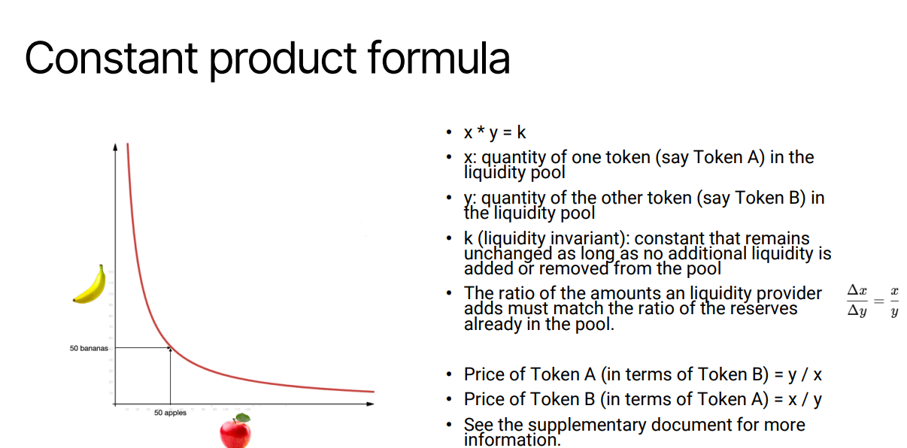

# Web3 Basics
## History of the web

- applications 
  - web 1 : web browsers, search engines
  - web 2 : Wikipedia, social media, e-commerce
  - web 3 : tokens
## Type of internet

## Web2 vs. web3

- 備註：簡單來說，web2主要採用集中式伺服器控制由單一企業管理，所以使用者的資料由企業保存並管理，主要透過廣告和訂閱賺取收益；web3則使用去中心化的架構，使用者透過加密密鑰掌控自己的資料，採用代幣經濟學，如用代幣獎勵使用者參與
## Hashing
- hashing function : H accepts a variable-length block of data Mas input and produces a fixed-size result h = H(M), referred to as a hash value, hash code, or digest.
## Basic blockchain

- component
  - data
  - hash
  - previous hash
- 備註：區塊鍊是一種分散式的資料庫技術，用於安全的紀錄資訊，由一連串的區塊所組成（也就是為什麼需要前一個的hash），形成不可更改的鍊，具有以下特性：
  - 去中心化
  - 不可竄改
  - 透明性
  - 安全性
- proof of work (PoW) : 是一種共識機制，應用於區塊鍊的分散是網路中，目的是確保網路的安全性，通過讓礦工解決一個高難度的數學問題來驗證交易和產生新的區塊，以下為其特點：
  - 工作量：問題的解決要消耗電力和時間
  - 競爭性：最先解出問題的礦工可獲得獎勵
  - 安全性：解題的高成本使得惡意攻擊便很困難，因為要重新解決整個鍊上的所有區塊
  - 去中心化：依靠礦工的集體運算維持網路
  - 優點
    - 高安全性
  - 缺點
    - 耗能巨大
    - 運行速度較慢
  - 備註：Pow 中的難題以比特幣為例，為 hashing function 的結果在前幾位必須是0，也因為其不可預測性，以至於需要大量的算力

- proof of stake (PoS) : 是一種共識機制，是 PoW 的主要替代方案，通過選定持有區塊鍊代幣的人來產生新的區塊，而不是靠大量計算，以下為其特點：
  - 基於權益的驗證：參與者須抵押一定數量的代幣做為保證，提供越多的抵押貸幣或選機率越高（線性）
  - 節能高效：相較 PoW 不需要大量的計算能力，能源消耗大幅降低
  - 經濟激勵：被選中的驗證者可獲的區塊獎勵，若驗證者試圖作弊，則抵押貸幣會被扣除作為懲罰
  - 去中心化：同樣維持網路的分散性，降低硬體需求及參與門檻
  - 優點
    - 節能環保能耗低
    - 更快的交易處理速度，因節點間不需要競爭解題
  - 缺點
    - 質押的權益集中化問題，可能導致富有的參與者有更高的控制權
    - 歷史紀錄的安全性驗證可能更薄弱
- smart contract : 智能合約是一種儲存在區塊鍊上的自動化程式，能在特定條件被滿足時自動執行合約內容，以程式碼的方式進行紀錄，並且不用第三方介入便可執行，具有高效率和可信度，以下為其特點：  
  - 自動執行
  - 不可更改
  - 透明性
  - 去中心化
- 不可竄蓋性的延伸（ledger tamper resistant）
    - 加密哈希技術：每個區塊都包含其前一個區塊的哈希值，因此修改任何一個區塊都會影響後續區塊，使篡改變得困難。
    - 共識機制：區塊鏈網絡依賴於像 工作量證明（PoW） 或 權益證明（PoS） 這樣的共識機制，確保多個節點共同驗證交易，使得單獨的惡意行為無法成功篡改賬本。例如：現在進度到第25個區塊，但想更改第21個區塊，就需要重新計算21-24且優先算出第25個區塊
    - 去中心化：數據存儲在眾多節點中，而非單一伺服器，意味著攻擊者必須篡改大部分節點才能成功，這在大型區塊鏈網絡中幾乎是不可能的。

## Reference model of blockchain

## Public ledger vs. private ledger
- 公開帳本（Public Ledger）
    - 開放性：任何人都可以加入網絡並查看交易記錄，例如比特幣（Bitcoin）和以太坊（Ethereum）。
    - 去中心化：由全球許多獨立節點共同維護，確保安全性和透明度。
    - 匿名性：交易記錄公開，但交易者的身份通常是匿名或使用錢包地址。
    - 交易驗證：通常使用 工作量證明（PoW） 或 權益證明（PoS） 來達成共識，確保交易不被篡改。
- 私有帳本（Private Ledger）
    - 訪問受限：只有獲得授權的使用者或機構才能查看和參與交易。
    - 集中管理：由一個或少數幾個組織控制，例如企業內部帳本。
    - 更高效：不需全網共識機制，交易處理速度更快且成本較低。
    - 隱私與合規性：適合企業或機構用於管理機密數據，如銀行系統或供應鏈管理。
- 備註：私有帳本沒有原生代幣（native token），主要透過企業級解決方案
獲利
    - SaaS（軟體即服務）企業可以提供私有區塊鏈技術作為訂閱服務，例如：
        - 供應鏈追蹤（如 IBM 的 Food Trust）
        - 金融交易與清算
        - 企業內部數據管理
    - 交易手續費:有些私有帳本允許合作夥伴使用，並對每筆交易收取少量手續費，類似銀行支付系統或 B2B 協作平台。
    - 授權或白標（White Labeling）企業可以授權自家區塊鏈技術，讓其他公司客製化應用。例如：
        - 金融機構使用私有鏈來處理貸款或支付
        - 大型企業整合區塊鏈來管理內部記錄
    - 顧問服務與客製化開發:許多企業需要區塊鏈專家來設計、開發或優化他們的私有帳本系統，專業顧問可以提供：
        - 區塊鏈架構設計
        - 網路安全與合規性
        - 智能合約開發
    - 數據貨幣化:私有區塊鏈擁有大量的交易和記錄數據，企業可以：
        - 提供數據分析服務
        - 與金融機構合作，提供高精度的風險評估數據
## Security of blockchain
- digital signature : 用來驗證交易的真實性和完整性。簡單來說，數字簽名就像是你在文件上簽名，但它是透過密碼學生成的，具有更強的安全性。
    - 身份驗證：確保交易是由合法的持有者發起，而不是被偽造或冒充。
    - 防篡改性：如果交易數據在傳輸過程中被修改，簽名就會失效，使得系統可以識別異常。
    - 不可否認性：簽名者無法否認自己簽署的交易，因為簽名是唯一且可驗證的。
    - workflow : 數字簽名通常依賴於 非對稱加密（Public-Key Cryptography），使用兩把密鑰：
        - 私鑰（Private Key）：用戶持有並用來簽署交易。
        - 公鑰（Public Key）：公開給其他人，用於驗證簽名的有效性。
        - 在區塊鏈交易中，當你發送交易時，你會使用私鑰對交易進行簽名。這個簽名可以被任何人使用你的公鑰來驗證，確保交易是由你發出的，且內容未被篡改。
- blockchain wallet : 是一種數字錢包，用來存儲、管理和交易加密貨幣（如比特幣、以太坊等）。它不像傳統銀行帳戶那樣存放實際的貨幣，而是存儲你的私鑰和公鑰，讓你能夠安全地使用區塊鏈網絡。
    - 私鑰（Private Key）：用於簽署交易，相當於你的密碼，絕對不能洩漏。
    - 公鑰（Public Key）：由私鑰生成，類似銀行帳戶號碼，別人可以用它來向你發送加密貨幣。
    - 錢包地址（Wallet Address）：公鑰的簡化版，通常是較短的字串，方便用來收款
## DeFi protocol
- uniswap : 去中心化交易所（DEX）
    - 允許使用者在 區塊鏈上交換代幣，不需要中介機構。
    - 採用 自動化做市商（AMM） 機制，透過流動性池來提供交易流動性。
- curve : 用於穩定幣的 DEX
    - 主要用來交換 穩定幣（如 USDT、USDC、DAI），提供低滑點交易。
    - 適合 穩定幣交易者與流動性提供者，讓資金更有效率地運作。
- makerDAO : 借貸與穩定幣協議
    - 允許使用者 抵押加密貨幣來生成 DAI（穩定幣），類似於去中心化銀行。
    - 透過 智能合約 控制穩定幣的供應，確保價值穩定。
- aave : 借貸與流動性市場
    - 允許使用者 存入加密貨幣來賺取利息，或 借出加密貨幣。
    - 提供 閃電貸（Flash Loans），讓使用者可以在 單一交易內借款並歸還，適合高級 DeFi 操作。
- 備註：什麼是穩定幣
    - 為什麼需要穩定幣？加密貨幣（如比特幣、以太坊）價格波動較大，可能一天內漲跌超過 10% 以上。穩定幣的設計目標是： ✅ 降低價格波動 → 讓交易更穩定，適合支付與存款
        - 提供避險工具 → 在市場波動時，投資者可以將資金轉換為穩定幣
        - 促進 DeFi（去中心化金融） → 穩定幣在借貸、交易、支付等應用中非常重要
    - 穩定幣的種類穩定幣的價值通常由以下方式支撐：
        - 法幣抵押型 → 由 美元、歐元等法定貨幣 支撐（如 USDT、USDC）
        - 商品抵押型 → 由 黃金、白銀等商品 支撐（如 PAXG）
        - 加密貨幣抵押型 → 由 其他加密貨幣 支撐（如 DAI）
        - 演算法穩定幣 → 透過 供需調節機制 維持價格（如 UST）
    - 穩定幣的應用
        - 交易媒介 → 在交易所中，穩定幣常用來兌換其他加密貨幣
        - 支付工具 → 一些企業接受穩定幣作為支付方式
        - DeFi 借貸 → 穩定幣可用於去中心化金融（DeFi）平台進行借貸
        - 國際匯款 → 穩定幣可以快速轉帳，避免傳統銀行的高額手續費
- 備註：閃電貸是什麼
    - 閃電貸（Flash Loan） 是 去中心化金融（DeFi） 中的一種特殊借貸機制，它允許使用者 在無需抵押的情況下借款，但必須在 同一筆交易內歸還。
    - 閃電貸的運作方式
        - 借款 → 使用者向 DeFi 平台（如 Aave）申請閃電貸，無需提供抵押品。
        - 執行交易 → 使用借款進行套利、抵押品轉換、清算等金融操作。
        - 還款 → 在 同一筆交易內 必須歸還借款，否則交易會被撤銷。
    -  如果借款人無法在同一筆交易內還款，整個交易會被取消，資金不會離開貸款平台！
- 備註：AMM 是什麼
    - 是 去中心化交易所（DEX） 的核心機制，它讓交易者可以在 無需傳統訂單簿 的情況下進行交易，而是透過 流動性池（Liquidity Pool） 和 數學公式 來決定價格。
    -  AMM 的運作方式
        - 流動性池（Liquidity Pool） → 交易者不需要與買家或賣家直接交易，而是與資金池互動
        - 數學公式定價 → 例如 恆定乘積公式（x × y = k），確保交易價格根據供需變動
        - 流動性提供者（LP） → 任何人都可以存入資金，並獲得交易手續費作為獎勵
## 補充：constant product formula

## Token sales
- RWA 
    - 提升流動性 → 透過代幣化，資產可以在區塊鏈上交易，降低傳統市場的流動性限制。
    - 降低投資門檻 → 允許部分所有權，投資者可以購買資產的一小部分，而非整個資產。
    - 提高透明度 → 所有交易都記錄在區塊鏈上，減少欺詐風險並提升市場信任度。
    - 加速交易與結算 → 傳統資產交易可能需要數天甚至數週，而區塊鏈技術可以實現即時結算。
    - 促進 DeFi 整合 → RWA 代幣可以用於去中心化金融（DeFi）平台，提供借貸、抵押等金融服務。
- key difference

|Feature|Initial coin offering(ICO)|Initial exchanging offering(IEO)|Initial DEX offering (IDO)|Security token offering(STO)|
|----|----|----|----|----|
|Platform|independent|centralized exchange|decentralized exchange|regulated platform|
|Regulation|low|moderate|low|high|
Intermediary|none|exchange|none|compliance authority|
Accessibility|high|moderate|high|limited to accredited investor|
Credibility|variable|higher|lower|high
[點我查看過往交易表現](https://cryptorank.io/ico)
## Why Web3
- core idea
    - decentralized : ownership can gets distributed amongst its builder and users
    - permissionless : everyone has equal access to participate in Web3, and no one gets excluded
    - native payment : use cryptocurrency for spending and sending money online instead of relying on outdated infrastructure 
    - trustless : operates using incentives and economic mechanisms instead of relying on trusted third-party
- importance
    - ownership : 使用者真正擁有數位資產，而不是平台所有，在傳統的 web2 中，使用者的數據內容甚至帳戶都會受到大型企業的控制，若平台停用你的帳戶，則會失去所有資料
    - censorship resistance : 確保資訊不會被單一機構或政府審查，在 web2 的世界中，大型平台可以根據政策刪除內容、禁用帳戶等，web3 則可使社交媒體去中心化，並分散式儲存
    - DAOs : 讓社群能夠自我管理，而不是依賴中央機構決策，能透過智能合約與投票機構讓所有成員都能夠參與決策
- limitation
    - accessibility : 目前不夠普及，許多人無法輕易使用，需要加密貨幣錢包和區塊鍊技術，交易時需要支付 Gas 費用
    - user experience : 操作體驗仍然不如 web2 ，主要有幾點：
        - 錢包管理：使用者必須記住私鑰，一旦丟失就無法找回
        - 交易速度：與傳統網路相比，區塊鍊交易通常比較慢，因為需要經過驗證
        - 應用程式介面：許多去中心化應用程式（DApps），仍然不夠直覺，使用者需要較長時間適應
    - education : 許多使用者對 web3 缺乏知識和理解，對於加密貨幣、智能合約的運作方式不理解，擔心與詐騙或是非法交易有關，缺乏政府和企業的教育推廣
    - centralized infrastructure : 雖然強調去中心化，但某些部分仍然依賴中心化服務，許多 DApps 仍然使用中心伺服器，且交易所仍是中心化，橋接技術也存在安全性風險
- 備註：橋接技術（跨鍊橋） : 是一種區塊鏈技術，讓使用者能夠在 不同的區塊鏈之間轉移資產、數據和資訊。這解決了各區塊鏈獨立運作的問題，使它們能夠互通
    - 為什麼需要跨鏈橋？
        - 不同區塊鏈使用不同的代幣和標準 → 例如，以太坊上的 USDT（ERC-20）與波場上的 USDT（TRC-20）是不同的代幣，無法直接互換。
        - 提升流動性 → 讓資產能夠在不同區塊鏈之間自由流動，提高市場效率。
        - 數據共享 → 讓不同區塊鏈上的應用能夠互相交換資訊，擴展功能。
    -  跨鏈橋的種類
        - 需信任跨鏈橋（Trusted Bridges） → 依賴中心化機構來管理跨鏈交易，適合新手，但存在中心化風險。
        - 去信任跨鏈橋（Trustless Bridges） → 透過智能合約自動執行跨鏈交易，無需信任第三方，安全性更高。
    - 跨鏈橋的風險
        - 智能合約漏洞 → 如果跨鏈橋的智能合約有漏洞，可能導致資金被駭客盜取。
        - 中心化風險 → 需信任跨鏈橋可能受到審查或管理者惡意操控。
        - 交易成本 → 某些跨鏈橋可能收取較高的手續費，影響交易效率
- 備註：Gas 費用 : 是區塊鏈交易中的手續費，主要用來支付網路驗證者（礦工或節點）處理交易的成本。這筆費用確保交易能夠被執行並記錄在區塊鏈上。
    - Gas 費的運作方式
        - 每筆交易都需要計算資源 → 區塊鏈上的交易（如轉帳、智能合約執行）需要礦工或驗證者來處理。
        - Gas 費用支付給礦工 → 這是他們維護網路的獎勵，確保交易能夠順利完成。
        - Gas 費 = Gas 價格 × Gas 限制 → 交易的複雜度決定了所需的 Gas 限制，而 Gas 價格則由市場供需決定。
    - 為什麼 Gas 費有時候很貴？
        - 網路擁塞 → 當區塊鏈交易量大時，Gas 費會上升，因為礦工會優先處理出價較高的交易。
        - 智能合約的複雜度 → 執行智能合約比單純的轉帳更耗費計算資源，因此需要更高的 Gas 費。
        - 區塊鏈機制 → 例如以太坊的 Gas 費通常較高，而某些 Layer 2 解決方案（如 Polygon）則提供較低的 Gas 費。

