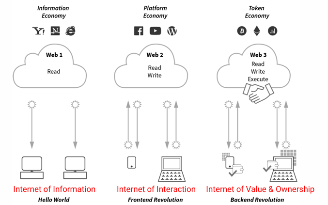
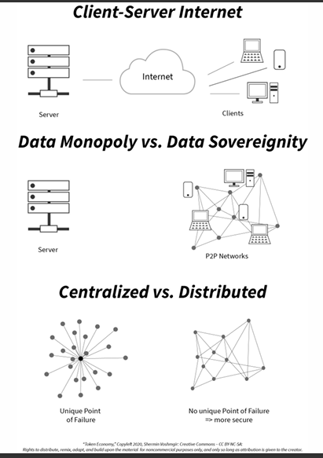
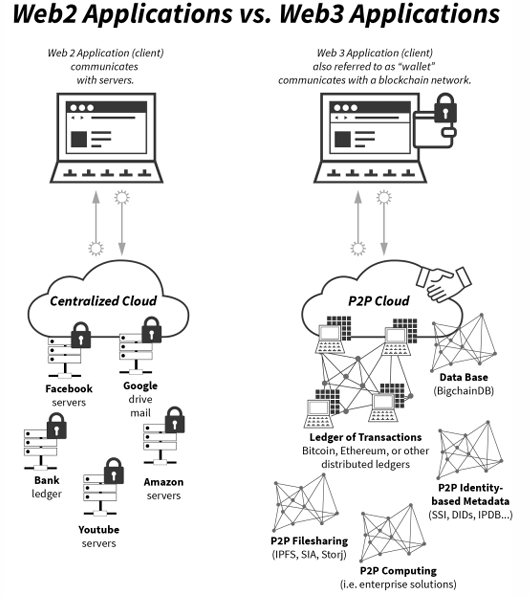
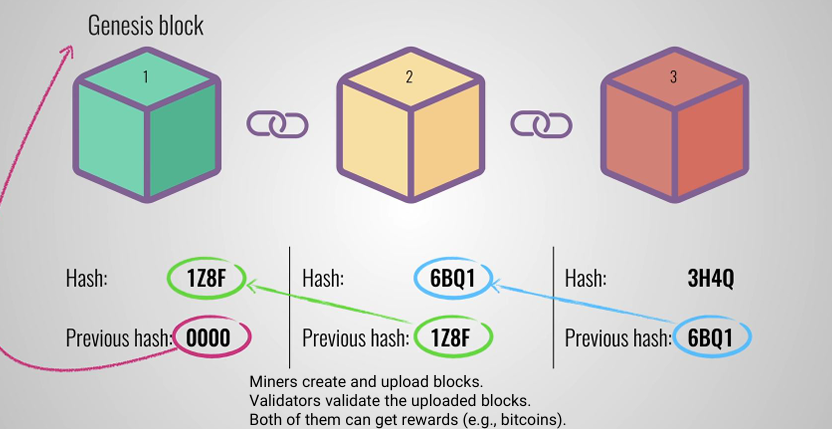

#　Web3 Basics
## History of the web

- applications 
  - web 1 : web browsers, search engines
  - web 2 : Wikipedia, social media, e-commerce
  - web 3 : tokens
## Type of internet

## Web2 vs. web3

- 備註：簡單來說，web2主要採用集中式伺服器控制由單一企業管理，所以使用者的資料由企業保存並管理，主要透過廣告和訂閱賺取收益；web3則使用去中心化的架構，使用者透過加密密鑰掌控自己的資料，採用代幣經濟學，如用代幣獎勵使用者參與
## Hashing
- hashing function : H accepts a variable-length block of data Mas input and produces a fixed-size result h = H(M), referred to as a hash value, hash code, or digest.
## Basic blockchain

- component
  - data
  - hash
  - previous hash
- 備註：區塊鍊是一種分散式的資料庫技術，用於安全的紀錄資訊，由一連串的區塊所組成（也就是為什麼需要前一個的hash），形成不可更改的鍊，具有以下特性：
  - 去中心化
  - 不可竄改
  - 透明性
  - 安全性
- proof of work (PoW) : 是一種共識機制，應用於區塊鍊的分散是網路中，目的是確保網路的安全性，通過讓礦工解決一個高難度的數學問題來驗證交易和產生新的區塊，以下為其特點：
  - 工作量：問題的解決要消耗電力和時間
  - 競爭性：最先解出問題的礦工可獲得獎勵
  - 安全性：解題的高成本使得惡意攻擊便很困難，因為要重新解決整個鍊上的所有區塊
  - 去中心化：依靠礦工的集體運算維持網路
  - 優點
    - 高安全性
  - 缺點
    - 耗能巨大
    - 運行速度較慢
  - 備註：Pow 中的難題以比特幣為例，為 hashing function 的結果在前幾位必須是0，也因為其不可預測性，以至於需要大量的算力
- proof of stake (PoS) : 是一種共識機制，是 PoW 的主要替代方案，通過選定持有區塊鍊代幣的人來產生新的區塊，而不是靠大量計算，以下為其特點：
  - 基於權益的驗證：參與者須抵押一定數量的代幣做為保證，提供越多的抵押貸幣或選機率越高（線性）
  - 節能高效：相較 PoW 不需要大量的計算能力，能源消耗大幅降低
  - 經濟激勵：被選中的驗證者可獲的區塊獎勵，若驗證者試圖作弊，則抵押貸幣會被扣除作為懲罰
  - 去中心化：同樣維持網路的分散性，降低硬體需求及參與門檻
  - 優點
    - 節能環保能耗低
    - 更快的交易處理速度，因節點間不需要競爭解題
  - 缺點
    - 質押的權益集中化問題，可能導致富有的參與者有更高的控制權
    - 歷史紀錄的安全性驗證可能更薄弱
- smart contract : 智能合約是一種儲存在區塊鍊上的自動化程式，能在特定條件被滿足時自動執行合約內容，以程式碼的方式進行紀錄，並且不用第三方介入便可執行，具有高效率和可信度，以下為其特點：  
  - 自動執行
  - 不可更改
  - 透明性
  - 去中心化