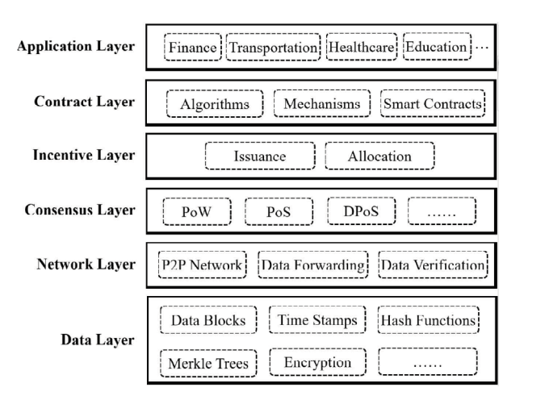

#　Web3 Basics
## History of the web

- applications 
  - web 1 : web browsers, search engines
  - web 2 : Wikipedia, social media, e-commerce
  - web 3 : tokens
## Type of internet

## Web2 vs. web3

- 備註：簡單來說，web2主要採用集中式伺服器控制由單一企業管理，所以使用者的資料由企業保存並管理，主要透過廣告和訂閱賺取收益；web3則使用去中心化的架構，使用者透過加密密鑰掌控自己的資料，採用代幣經濟學，如用代幣獎勵使用者參與
## Hashing
- hashing function : H accepts a variable-length block of data Mas input and produces a fixed-size result h = H(M), referred to as a hash value, hash code, or digest.
## Basic blockchain

- component
  - data
  - hash
  - previous hash
- 備註：區塊鍊是一種分散式的資料庫技術，用於安全的紀錄資訊，由一連串的區塊所組成（也就是為什麼需要前一個的hash），形成不可更改的鍊，具有以下特性：
  - 去中心化
  - 不可竄改
  - 透明性
  - 安全性
- proof of work (PoW) : 是一種共識機制，應用於區塊鍊的分散是網路中，目的是確保網路的安全性，通過讓礦工解決一個高難度的數學問題來驗證交易和產生新的區塊，以下為其特點：
  - 工作量：問題的解決要消耗電力和時間
  - 競爭性：最先解出問題的礦工可獲得獎勵
  - 安全性：解題的高成本使得惡意攻擊便很困難，因為要重新解決整個鍊上的所有區塊
  - 去中心化：依靠礦工的集體運算維持網路
  - 優點
    - 高安全性
  - 缺點
    - 耗能巨大
    - 運行速度較慢
  - 備註：Pow 中的難題以比特幣為例，為 hashing function 的結果在前幾位必須是0，也因為其不可預測性，以至於需要大量的算力

- proof of stake (PoS) : 是一種共識機制，是 PoW 的主要替代方案，通過選定持有區塊鍊代幣的人來產生新的區塊，而不是靠大量計算，以下為其特點：
  - 基於權益的驗證：參與者須抵押一定數量的代幣做為保證，提供越多的抵押貸幣或選機率越高（線性）
  - 節能高效：相較 PoW 不需要大量的計算能力，能源消耗大幅降低
  - 經濟激勵：被選中的驗證者可獲的區塊獎勵，若驗證者試圖作弊，則抵押貸幣會被扣除作為懲罰
  - 去中心化：同樣維持網路的分散性，降低硬體需求及參與門檻
  - 優點
    - 節能環保能耗低
    - 更快的交易處理速度，因節點間不需要競爭解題
  - 缺點
    - 質押的權益集中化問題，可能導致富有的參與者有更高的控制權
    - 歷史紀錄的安全性驗證可能更薄弱
- smart contract : 智能合約是一種儲存在區塊鍊上的自動化程式，能在特定條件被滿足時自動執行合約內容，以程式碼的方式進行紀錄，並且不用第三方介入便可執行，具有高效率和可信度，以下為其特點：  
  - 自動執行
  - 不可更改
  - 透明性
  - 去中心化
- 不可竄蓋性的延伸（ledger tamper resistant）
    - 加密哈希技術：每個區塊都包含其前一個區塊的哈希值，因此修改任何一個區塊都會影響後續區塊，使篡改變得困難。
    - 共識機制：區塊鏈網絡依賴於像 工作量證明（PoW） 或 權益證明（PoS） 這樣的共識機制，確保多個節點共同驗證交易，使得單獨的惡意行為無法成功篡改賬本。例如：現在進度到第25個區塊，但想更改第21個區塊，就需要重新計算21-24且優先算出第25個區塊
    - 去中心化：數據存儲在眾多節點中，而非單一伺服器，意味著攻擊者必須篡改大部分節點才能成功，這在大型區塊鏈網絡中幾乎是不可能的。

## Reference model of blockchain

## Public ledger vs. private ledger
- 公開帳本（Public Ledger）
    - 開放性：任何人都可以加入網絡並查看交易記錄，例如比特幣（Bitcoin）和以太坊（Ethereum）。
    - 去中心化：由全球許多獨立節點共同維護，確保安全性和透明度。
    - 匿名性：交易記錄公開，但交易者的身份通常是匿名或使用錢包地址。
    - 交易驗證：通常使用 工作量證明（PoW） 或 權益證明（PoS） 來達成共識，確保交易不被篡改。
- 私有帳本（Private Ledger）
    - 訪問受限：只有獲得授權的使用者或機構才能查看和參與交易。
    - 集中管理：由一個或少數幾個組織控制，例如企業內部帳本。
    - 更高效：不需全網共識機制，交易處理速度更快且成本較低。
    - 隱私與合規性：適合企業或機構用於管理機密數據，如銀行系統或供應鏈管理。
- 備註：私有帳本沒有原生代幣（native token），主要透過企業級解決方案
獲利
    - SaaS（軟體即服務）企業可以提供私有區塊鏈技術作為訂閱服務，例如：
        - 供應鏈追蹤（如 IBM 的 Food Trust）
        - 金融交易與清算
        - 企業內部數據管理
    - 交易手續費:有些私有帳本允許合作夥伴使用，並對每筆交易收取少量手續費，類似銀行支付系統或 B2B 協作平台。
    - 授權或白標（White Labeling）企業可以授權自家區塊鏈技術，讓其他公司客製化應用。例如：
        - 金融機構使用私有鏈來處理貸款或支付
        - 大型企業整合區塊鏈來管理內部記錄
    - 顧問服務與客製化開發:許多企業需要區塊鏈專家來設計、開發或優化他們的私有帳本系統，專業顧問可以提供：
        - 區塊鏈架構設計
        - 網路安全與合規性
        - 智能合約開發
    - 數據貨幣化:私有區塊鏈擁有大量的交易和記錄數據，企業可以：
        - 提供數據分析服務
        - 與金融機構合作，提供高精度的風險評估數據
## Security of blockchain
- digital signature : 用來驗證交易的真實性和完整性。簡單來說，數字簽名就像是你在文件上簽名，但它是透過密碼學生成的，具有更強的安全性。
    - 身份驗證：確保交易是由合法的持有者發起，而不是被偽造或冒充。
    - 防篡改性：如果交易數據在傳輸過程中被修改，簽名就會失效，使得系統可以識別異常。
    - 不可否認性：簽名者無法否認自己簽署的交易，因為簽名是唯一且可驗證的。
    - workflow : 數字簽名通常依賴於 非對稱加密（Public-Key Cryptography），使用兩把密鑰：
        - 私鑰（Private Key）：用戶持有並用來簽署交易。
        - 公鑰（Public Key）：公開給其他人，用於驗證簽名的有效性。
        - 在區塊鏈交易中，當你發送交易時，你會使用私鑰對交易進行簽名。這個簽名可以被任何人使用你的公鑰來驗證，確保交易是由你發出的，且內容未被篡改。
- blockchain wallet : 是一種數字錢包，用來存儲、管理和交易加密貨幣（如比特幣、以太坊等）。它不像傳統銀行帳戶那樣存放實際的貨幣，而是存儲你的私鑰和公鑰，讓你能夠安全地使用區塊鏈網絡。
    - 私鑰（Private Key）：用於簽署交易，相當於你的密碼，絕對不能洩漏。
    - 公鑰（Public Key）：由私鑰生成，類似銀行帳戶號碼，別人可以用它來向你發送加密貨幣。
    - 錢包地址（Wallet Address）：公鑰的簡化版，通常是較短的字串，方便用來收款

